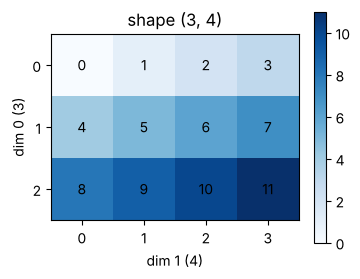
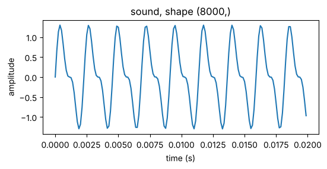
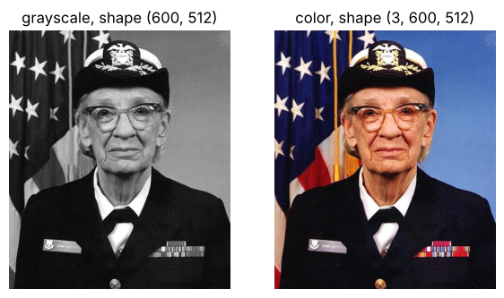

# 00-02 텐서 기초

[](https://colab.research.google.com/github/alsrjs0725/EntryToPytorchForStudent/blob/main/notebooks/00-시작하기/02-텐서-기초.ipynb)

텐서(tensor)는 PyTorch가 숫자를 담는 기본 자료형이에요. 모델의 입력, 출력, 가중치가 모두 텐서예요. 이 문서를 마치면 텐서를 만들고, 모양을 바꾸고, 계산하고, GPU로 옮길 수 있어요.

**사전 지식:** [00-01 Colab 시작하기](01-colab-시작하기.md)

## 1. 텐서 만들기

텐서는 숫자를 여러 축으로 쌓은 배열이에요. 파이썬 리스트를 `torch.tensor()`에 넣으면 텐서가 돼요.

```python
a = torch.tensor([1.0, 2.0, 3.0])          # (3,)
b = torch.tensor([[1, 2, 3], [4, 5, 6]])   # (2, 3)
print(a.shape, b.shape)
print(a.dtype, b.dtype)
```

```
torch.Size([3]) torch.Size([2, 3])
torch.float32 torch.int64
```

텐서를 다룰 때는 두 가지를 늘 확인해요.

- **모양(shape):** 축마다 숫자가 몇 개인지예요. `(2, 3)`은 2행 3열이에요.
- **자료형(dtype):** 숫자의 종류예요. 소수는 `float32`, 정수는 `int64`가 기본이에요. 모델 계산은 대부분 `float32`로 해요.

이 튜토리얼의 코드는 텐서를 만드는 줄 끝에 `# (2, 3)`처럼 모양을 주석으로 적어요.

값을 정해서 만들 수도 있어요.

```python
torch.zeros(2, 3)   # 모두 0, (2, 3)
torch.ones(2, 3)    # 모두 1, (2, 3)
torch.rand(2, 3)    # 0~1 사이 무작위 값, (2, 3)
torch.arange(6)     # 0부터 5까지, (6,)
```

`torch.manual_seed(0)`을 먼저 실행하면 무작위 값이 매번 같게 나와요. 이 튜토리얼의 노트북은 모두 첫 셀에서 이 줄을 실행해요.

2차원 텐서는 표로 그려 보면 모양을 이해하기 쉬워요. `torch.arange(12).reshape(3, 4)`를 그리면 이렇게 돼요.

{ width="400" }

0번 축(dim 0)은 행 방향, 1번 축(dim 1)은 열 방향이에요.

### 차원마다 담기는 데이터

`arange`로 만든 숫자만 보면 텐서가 어디에 쓰이는지 감이 잘 오지 않아요. 실제 데이터는 차원 수에 따라 대략 이렇게 담겨요.

| 차원 | 예시 | 모양 |
| --- | --- | --- |
| 1차원 | 소리 | `(샘플 수,)` |
| 2차원 | 흑백 이미지 | `(높이, 너비)` |
| 3차원 | 컬러 이미지 | `(채널, 높이, 너비)` |
| 4차원 | 영상 | `(프레임 수, 채널, 높이, 너비)` |

**1차원: 소리.** 소리는 공기의 떨림을 1초에 수천 번 재서 숫자로 기록한 거예요. 시간 순서대로 숫자가 한 줄로 늘어서니 1차원 텐서예요.

```python
sr = 8000                                   # 1초에 8000번 기록해요
t = torch.arange(sr) / sr                   # (8000,) 0초부터 1초까지의 시각
sound = torch.sin(2 * torch.pi * 440 * t) + 0.5 * torch.sin(2 * torch.pi * 880 * t)  # (8000,)
plt.plot(t[:160], sound[:160])              # 앞쪽 0.02초만 그려요
```

{ width="500" }

노트북에서는 `Audio(sound.numpy(), rate=sr)`로 이 텐서를 직접 들어 볼 수 있어요.

**2차원과 3차원: 이미지.** 흑백 이미지는 칸마다 밝기 하나가 있는 표라서 `(높이, 너비)` 2차원이에요. 컬러 이미지는 빨강(R), 초록(G), 파랑(B) 밝기 표가 3장 겹친 것이라 `(3, 높이, 너비)` 3차원이에요. 이 3장을 채널(channel)이라고 해요.

```python
from matplotlib import cbook

photo = torch.tensor(plt.imread(cbook.get_sample_data("grace_hopper.jpg")))  # (600, 512, 3)
color = photo.permute(2, 0, 1).float() / 255  # (3, 600, 512), 0~1 사이 값
gray = color.mean(dim=0)                      # (600, 512), 세 채널의 평균
```

사진은 matplotlib에 들어 있는 컴퓨터 과학자 그레이스 호퍼(Grace Hopper)의 사진이라 따로 내려받지 않아도 돼요. `plt.imread`는 `(높이, 너비, 채널)` 순서로 읽어요. PyTorch는 채널을 맨 앞에 두는 `(채널, 높이, 너비)` 순서를 써서 `permute`로 축 순서를 바꿨어요. 반대로 matplotlib으로 그릴 때는 `color.permute(1, 2, 0)`으로 다시 채널을 맨 뒤로 보내요.

{ width="550" }

**4차원: 영상.** 영상은 컬러 이미지(프레임)를 시간 순서로 쌓은 거예요. 아래 코드는 사진 위에서 잘라 내는 위치를 조금씩 아래로 옮겨, 카메라가 내려가는 4프레임짜리 영상을 만들어요.

```python
video = torch.stack([color[:, 60 * i : 60 * i + 300, 100:400] for i in range(4)])  # (4, 3, 300, 300)
```


컬러 이미지 여러 장을 한 번에 묶은 배치(batch)도 `(장 수, 채널, 높이, 너비)` 4차원이에요. 같은 4차원이어도 첫 번째 축이 시간인지 이미지 번호인지는 데이터마다 달라요.

### 차원이 같아도 그리는 방법은 달라요

텐서의 모양만 보고 그래프를 고르면 안 돼요. 각 축이 무엇을 뜻하는지에 따라 알맞은 그림이 달라요.

```python
scores = (torch.randn(100) * 10 + 70).clamp(0, 100)  # (100,) 학생 100명의 점수
points = torch.randn(200, 2)                         # (200, 2) 평면 위의 점 200개
```


- **1차원 소리와 점수:** 소리는 순서가 곧 시간이라 선으로 이어 그려요. 점수는 학생 순서에 의미가 없으니 점수대별 인원을 세는 히스토그램(histogram)으로 그려요.
- **2차원 흑백 이미지와 점 좌표:** 흑백 이미지는 두 축이 모두 위치라서 칸마다 밝기를 칠해요. `(200, 2)` 점 좌표는 0번 축이 점 번호, 1번 축이 x, y 좌표라서 점을 찍는 산점도(scatter plot)로 그려요. 다음 챕터의 레이어 그림이 바로 이 산점도예요.

## 2. 모양 바꾸기

`reshape`는 숫자는 그대로 두고 모양만 바꿔요. 전체 개수는 같아야 해요. `-1`을 쓰면 남는 크기를 자동으로 계산해요.

```python
x = torch.arange(12)            # (12,)
print(x.reshape(3, 4).shape)    # (3, 4)
print(x.reshape(2, 2, 3).shape) # (2, 2, 3)
print(x.reshape(4, -1).shape)   # (4, 3)
```

<video src="../../videos/00-시작하기/tensor_reshape.mp4" controls autoplay loop muted playsinline width="600"></video>

축을 더하거나 빼거나 바꿀 때는 다음을 써요.

| 코드 | 하는 일 | 모양 변화 |
| --- | --- | --- |
| `m.T` | 행과 열 바꾸기(전치) | `(2, 3)` → `(3, 2)` |
| `m.unsqueeze(0)` | 0번 자리에 크기 1인 축 추가 | `(2, 3)` → `(1, 2, 3)` |
| `m.squeeze(0)` | 0번 자리의 크기 1인 축 제거 | `(1, 2, 3)` → `(2, 3)` |
| `m.transpose(1, 2)` | 1번 축과 2번 축 바꾸기 | `(B, T, H)` → `(B, H, T)` |

## 3. 인덱싱

파이썬 리스트처럼 `[]`로 꺼내요. 축마다 쉼표로 구분해요.

```python
m = torch.arange(12).reshape(3, 4)  # (3, 4)
print(m[0])       # 첫 번째 행, (4,)
print(m[:, 1])    # 두 번째 열, (3,)
print(m[1:, 2:])  # (2, 2)
print(m[m > 6])   # 조건에 맞는 값만, (5,)
```

```
tensor([0, 1, 2, 3])
tensor([1, 5, 9])
tensor([[ 6,  7],
        [10, 11]])
tensor([ 7,  8,  9, 10, 11])
```

<video src="../../videos/00-시작하기/tensor_indexing.mp4" controls autoplay loop muted playsinline width="600"></video>

## 4. 연산

`+`, `*` 같은 연산은 **같은 위치끼리** 계산해요. `sum`, `mean`에 `dim`을 주면 그 축을 따라 계산하고, 그 축은 사라져요.

```python
x = torch.tensor([[1.0, 2.0], [3.0, 4.0]])  # (2, 2)
print(x * x)
print(x.sum(dim=0))  # 0번 축을 따라 더하기, (2,)
print(x.sum(dim=1))  # 1번 축을 따라 더하기, (2,)
```

```
tensor([[ 1.,  4.],
        [ 9., 16.]])
tensor([4., 6.])
tensor([3., 7.])
```

<video src="../../videos/00-시작하기/tensor_sum.mp4" controls autoplay loop muted playsinline width="600"></video>

`@`는 행렬 곱이에요. `(4, 3) @ (3, 2)`처럼 앞 텐서의 마지막 크기와 뒤 텐서의 첫 크기가 같아야 하고, 결과는 `(4, 2)`가 돼요. 행렬 곱은 다음 챕터의 레이어에서 가장 많이 쓰는 연산이에요.

```python
A = torch.rand(4, 3)  # (4, 3)
B = torch.rand(3, 2)  # (3, 2)
C = A @ B             # (4, 2)
```

<video src="../../videos/00-시작하기/tensor_matmul.mp4" controls autoplay loop muted playsinline width="600"></video>

## 5. 브로드캐스팅

모양이 다른 텐서끼리 계산하면 PyTorch가 작은 텐서를 늘려서 맞춰요. 이걸 브로드캐스팅(broadcasting)이라고 해요.

```python
x = torch.zeros(4, 3)                 # (4, 3)
bias = torch.tensor([1.0, 2.0, 3.0])  # (3,)
print(x + bias)                       # (4, 3)
```

```
tensor([[1., 2., 3.],
        [1., 2., 3.],
        [1., 2., 3.],
        [1., 2., 3.]])
```

<video src="../../videos/00-시작하기/tensor_broadcast.mp4" controls autoplay loop muted playsinline width="600"></video>

`(3,)`짜리 `bias`가 4개 행에 똑같이 더해졌어요. 레이어에서 편향을 더할 때 이 방식을 써요.

## 6. GPU로 옮기기

텐서는 처음에 CPU 메모리에 만들어져요. `.to(device)`로 GPU로 옮겨요.

```python
x = torch.rand(3, 3)  # (3, 3)
print(x.device)       # cpu
x_gpu = x.to(device)
print(x_gpu.device)   # GPU를 켰다면 cuda:0
```

계산에 쓰는 텐서는 **모두 같은 장치**에 있어야 해요. GPU 텐서와 CPU 텐서를 더하면 `RuntimeError: Expected all tensors to be on the same device`로 시작하는 오류가 나요. 노트북의 `try` 셀을 GPU에서 실행해 직접 확인해 보세요.

GPU는 큰 행렬 곱을 CPU보다 훨씬 빠르게 계산해요. 노트북의 `time_matmul` 셀은 `(2048, 2048)` 행렬 곱 시간을 재요. CPU 환경에서는 한 번에 47.6ms가 걸렸어요. Colab T4 GPU에서 실행해 GPU 시간과 비교해 보세요.

## 7. 파이썬 값과 NumPy로 바꾸기

값이 하나뿐인 텐서는 `.item()`으로 파이썬 숫자로 바꿔요. 손실 값을 출력하거나 기록할 때 써요. NumPy 배열이 필요하면 `.cpu().numpy()`를 써요. GPU 텐서는 먼저 CPU로 옮겨야 해요.

```python
s = torch.tensor([1.0, 2.0, 3.0]).sum()
print(s, s.item())
```

```
tensor(6.) 6.0
```

## 정리

- 텐서는 모양(shape)과 자료형(dtype)을 가진 숫자 배열이에요.
- `reshape`, `unsqueeze`, `transpose`로 모양을 바꾸고, `@`로 행렬 곱을 해요.
- 계산하는 텐서는 모두 `.to(device)`로 같은 장치에 둬요.

**다음 문서:** [01-01 레이어는 공간을 바꾸는 함수예요](../01-레이어-이론/01-레이어는-공간을-바꾸는-함수.md)
