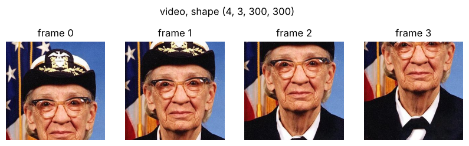
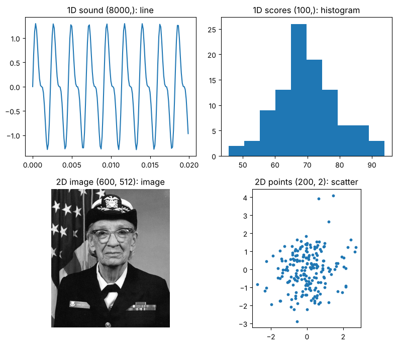

# 00-03 텐서에 담기는 데이터

[](https://colab.research.google.com/github/alsrjs0725/EntryToPytorchForStudent/blob/main/notebooks/00-시작하기/03-텐서에-담기는-데이터.ipynb)

`arange`로 만든 숫자만 보면 텐서가 어디에 쓰이는지 감이 잘 오지 않아요. 이 문서에서는 소리, 이미지, 영상 같은 실제 데이터가 어떤 모양의 텐서에 담기는지 봐요. 이 문서를 마치면 데이터를 보고 텐서 모양을 말할 수 있고, 축의 뜻에 맞는 그래프를 고를 수 있어요.

**사전 지식:** [00-02 텐서 기초](02-텐서-기초.md)

이 문서의 코드는 노트북 첫 셀을 먼저 실행했다고 가정해요.

```python
import torch
import matplotlib.pyplot as plt

device = "cuda" if torch.cuda.is_available() else "cpu"
torch.manual_seed(0)
```

## 1. 차원마다 담기는 데이터

실제 데이터는 차원 수에 따라 대략 이렇게 담겨요.

| 차원 | 예시 | 모양 |
| --- | --- | --- |
| 1차원 | 소리 | `(샘플 수,)` |
| 2차원 | 흑백 이미지 | `(높이, 너비)` |
| 3차원 | 컬러 이미지 | `(채널, 높이, 너비)` |
| 4차원 | 영상 | `(프레임 수, 채널, 높이, 너비)` |

**1차원: 소리.** 소리는 공기의 떨림을 1초에 수천 번 재서 숫자로 기록한 거예요. 시간 순서대로 숫자가 한 줄로 늘어서니 1차원 텐서예요.

```python
sr = 8000                                   # 1초에 8000번 기록해요
t = torch.arange(sr) / sr                   # (8000,) 0초부터 1초까지의 시각
sound = torch.sin(2 * torch.pi * 440 * t) + 0.5 * torch.sin(2 * torch.pi * 880 * t)  # (8000,)
plt.plot(t[:160], sound[:160])              # 앞쪽 0.02초만 그려요
```

{ width="500" }

노트북에서는 `Audio(sound.numpy(), rate=sr)`로 이 텐서를 직접 들어 볼 수 있어요.

**2차원과 3차원: 이미지.** 흑백 이미지는 칸마다 밝기 하나가 있는 표라서 `(높이, 너비)` 2차원이에요. 컬러 이미지는 빨강(R), 초록(G), 파랑(B) 밝기 표가 3장 겹친 것이라 `(3, 높이, 너비)` 3차원이에요. 밝기 표 한 장 한 장을 채널(channel)이라고 해요.

```python
from matplotlib import cbook

photo = torch.tensor(plt.imread(cbook.get_sample_data("grace_hopper.jpg")))  # (600, 512, 3)
color = photo.permute(2, 0, 1).float() / 255  # (3, 600, 512), 0~1 사이 값
gray = color.mean(dim=0)                      # (600, 512), 세 채널의 평균
```

사진은 matplotlib에 들어 있는 컴퓨터 과학자 그레이스 호퍼(Grace Hopper)의 사진이라 따로 내려받지 않아도 돼요. `plt.imread`는 `(높이, 너비, 채널)` 순서로 읽어요. PyTorch는 채널을 맨 앞에 두는 `(채널, 높이, 너비)` 순서를 써서 00-02에서 본 `permute`로 축 순서를 바꿨어요. 반대로 matplotlib으로 그릴 때는 `color.permute(1, 2, 0)`으로 다시 채널을 맨 뒤로 보내요.

{ width="550" }

**4차원: 영상.** 영상은 컬러 이미지(프레임)를 시간 순서로 쌓은 거예요. 아래 코드는 사진 위에서 잘라 내는 위치를 조금씩 아래로 옮겨, 카메라가 내려가는 4프레임짜리 영상을 만들어요. `torch.stack`은 모양이 같은 텐서 여러 개를 새 0번 축으로 쌓아요.

```python
video = torch.stack([color[:, 60 * i : 60 * i + 300, 100:400] for i in range(4)])  # (4, 3, 300, 300)
```



컬러 이미지 여러 장을 한 번에 묶은 배치(batch)도 `(장 수, 채널, 높이, 너비)` 4차원이에요. 같은 4차원이어도 첫 번째 축이 시간인지 이미지 번호인지는 데이터마다 달라요.

## 2. 같은 차원, 다른 그래프

텐서의 모양만 보고 그래프를 고르면 안 돼요. 각 축이 무엇을 뜻하는지에 따라 알맞은 그림이 달라요.

```python
scores = (torch.randn(100) * 10 + 70).clamp(0, 100)  # (100,) 학생 100명의 점수
points = torch.randn(200, 2)                         # (200, 2) 평면 위의 점 200개
```



- **1차원 소리와 점수:** 소리는 순서가 곧 시간이라 선으로 이어 그려요. 점수는 학생 순서에 의미가 없으니 점수대별 인원을 세는 히스토그램(histogram)으로 그려요.
- **2차원 흑백 이미지와 점 좌표:** 흑백 이미지는 두 축이 모두 위치라서 칸마다 밝기를 칠해요. `(200, 2)` 점 좌표는 0번 축이 점 번호, 1번 축이 x, y 좌표라서 점을 찍는 산점도(scatter plot)로 그려요. 다음 챕터의 레이어 그림이 바로 이 산점도예요.

## 정리

- 소리는 `(샘플 수,)`, 흑백 이미지는 `(높이, 너비)`, 컬러 이미지는 `(채널, 높이, 너비)`, 영상은 `(프레임 수, 채널, 높이, 너비)`예요.
- PyTorch는 채널을 맨 앞에, matplotlib은 맨 뒤에 둬요. 둘 사이는 `permute`로 바꿔요.
- 모양이 같아도 각 축이 무엇을 뜻하는지에 따라 선 그래프, 히스토그램, 이미지, 산점도 중에서 골라요.

**다음 문서:** [01-01 레이어는 공간을 바꾸는 함수예요](../01-레이어-이론/01-레이어는-공간을-바꾸는-함수.md)
