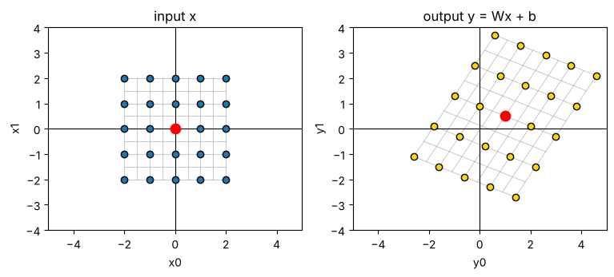
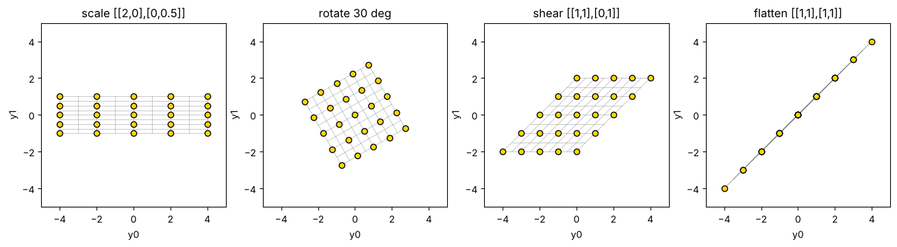
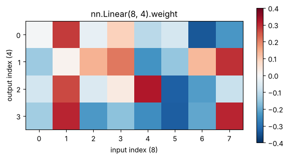
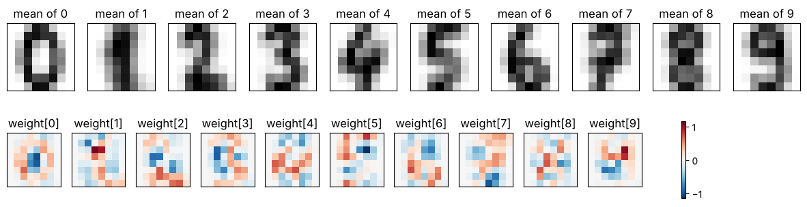

# 01-01 레이어는 공간을 바꾸는 함수예요

[](https://colab.research.google.com/github/alsrjs0725/EntryToPytorchForStudent/blob/main/notebooks/01-레이어-이론/01-레이어는-공간을-바꾸는-함수.ipynb)

레이어(layer)는 숫자 묶음을 받아 다른 숫자 묶음을 내는 함수예요. 가장 기본인 선형 레이어(linear layer)는 입력 공간을 늘이고, 기울이고, 옮겨요. 이 문서를 마치면 선형 레이어 `y = Wx + b`가 점들을 어떻게 옮기는지 그림으로 설명할 수 있어요.

**사전 지식:** [00-02 텐서 기초](../00-시작하기/02-텐서-기초.md)의 행렬 곱과 브로드캐스팅

<video src="../../videos/01-레이어-이론/linear_layer.mp4" controls autoplay loop muted playsinline width="600"></video>

## 1. 문제: 숫자를 원하는 숫자로 바꾸고 싶어요

머신러닝 모델은 입력 숫자를 받아 원하는 출력 숫자를 내요. 사진 픽셀 값을 받아 "고양이일 점수"를 내는 식이에요. 이 변환을 여러 단계로 나눈 것 하나하나가 레이어예요.

레이어가 하는 일을 눈으로 보려고 입력을 2차원 점으로 정해요. -2부터 2까지 정수 좌표의 점 25개를 준비해요.

```python
xs = torch.arange(-2, 3, dtype=torch.float32)  # (5,)
grid = torch.cartesian_prod(xs, xs)            # (25, 2), 각 행이 점 하나 (x0, x1)
```

여기서 `x`는 x축이 아니라 **점 하나 전체**예요. 점 하나는 숫자 2개 `(x0, x1)`로 이루어진 2차원 데이터예요. 레이어를 지난 출력 `y`도 숫자 2개 `(y0, y1)`예요. 그림의 가로축은 `x0`, 세로축은 `x1`이에요.

숫자가 3개면 `x = (x0, x1, x2)`인 3차원 데이터예요. 예를 들어 키, 몸무게, 나이로 사람 한 명을 나타내면 3차원 데이터 하나예요. 눈으로 보기 쉬워서 이 문서는 2차원을 써요.

## 2. 아이디어: 곱하고 더하기

먼저 숫자 하나를 받아 숫자 하나를 내는 경우부터 봐요. 입력 `x`에 가중치(weight) `w`를 곱하고 편향(bias) `b`를 더해요.

$$
y = w \cdot x + b
$$

맨 위 영상의 앞부분처럼 `w = 1`, `b = 0`이면 점이 그대로예요. 두 숫자를 바꾸면 이렇게 달라져요.

- `w`가 1보다 크면 점 사이가 늘어나고, 1보다 작으면 줄어들어요.
- `w`가 음수면 좌우가 뒤집혀요.
- `b`를 더하면 모든 점이 같은 만큼 옮겨져요.

입력이 숫자 2개 `(x0, x1)`이고 출력도 2개 `(y0, y1)`이면, 출력마다 이런 식이 하나씩 생겨요. 이제 출력 하나가 입력 2개를 모두 써요.

$$
\begin{aligned}
y_0 &= W_{00} x_0 + W_{01} x_1 + b_0 \\
y_1 &= W_{10} x_0 + W_{11} x_1 + b_1
\end{aligned}
$$

곱하는 숫자 4개를 행렬 `W`로, 더하는 숫자 2개를 벡터 `b`로 묶으면 선형 레이어의 식이 돼요.

$$
y = Wx + b
$$

- **가중치 `W`:** 공간을 늘이고, 줄이고, 기울이고, 돌려요.
- **편향 `b`:** 공간 전체를 한 방향으로 옮겨요.

## 3. 코드: 직접 만들기

점 25개를 한 번에 계산하려고 `x @ W.T + b`로 써요. 점 하나씩 `Wx`를 계산한 것과 같아요. `b`는 브로드캐스팅으로 모든 점에 더해져요.

```python
W = torch.tensor([[1.0, 0.8], [-0.4, 1.2]])  # (2, 2), 가중치
b = torch.tensor([1.0, 0.5])                 # (2,), 편향

def linear(x):
    # x: (N, 2) -> (N, 2)
    return x @ W.T + b

out = linear(grid)  # (25, 2)
print(grid[0], "->", out[0])
```

```
tensor([-2., -2.]) -> tensor([-2.6000, -1.1000])
```

## 4. 결과 확인: 공간이 바뀌었어요

입력 점(파랑)과 출력 점(노랑)을 나란히 그려요. 회색 격자선도 같은 함수에 통과시켰어요. 빨간 점은 원점 `(0, 0)`에서 출발한 점이에요.



- 정사각형 격자가 평행사변형으로 바뀌었어요. `W`가 공간을 늘이고 기울였어요.
- 원점에 있던 빨간 점이 `(1.0, 0.5)`로 옮겨졌어요. 바로 `b`만큼이에요.
- 직선은 직선으로, 평행한 선은 평행하게 남아요. 그래서 "선형"이라고 불러요.

### 가중치를 바꾸면 변환도 바뀌어요

`W`의 값에 따라 공간이 전혀 다르게 바뀌어요. 학습은 결국 원하는 변환이 나오도록 `W`와 `b`를 찾는 일이에요.



그림의 축은 출력 `(y0, y1)`이에요. 마지막 `[[1, 1], [1, 1]]`은 모든 점을 한 직선 위로 납작하게 눌러요. 이렇게 정보를 잃는 변환도 있어요.

## 5. PyTorch의 `nn.Linear`

PyTorch에는 선형 레이어가 `nn.Linear`로 들어 있어요. `nn.Linear(입력 수, 출력 수)`로 만들면 가중치와 편향을 무작위 값으로 채워 줘요. 같은 `W`, `b`를 넣으면 직접 만든 함수와 결과가 같아요.

```python
layer = nn.Linear(2, 2)
print(layer.weight.shape, layer.bias.shape)  # (2, 2), (2,)

with torch.no_grad():
    layer.weight.copy_(W)
    layer.bias.copy_(b)

print(torch.allclose(layer(grid), out))
```

```
torch.Size([2, 2]) torch.Size([2])
True
```

`torch.no_grad()`는 "이 계산은 학습 기록에 남기지 마"라는 뜻이에요. [01-03](03-손실과-경사-하강법.md)에서 자세히 다뤄요.

## 6. 입력과 출력의 크기가 달라도 돼요

입력이 8개, 출력이 4개인 레이어도 만들 수 있어요. 가중치 모양은 `(출력 수, 입력 수)`예요. 입력 앞쪽의 배치(batch) 축은 "점 여러 개를 한 번에"라는 뜻이고, 레이어는 마지막 축만 바꿔요.

```python
layer = nn.Linear(8, 4)
x = torch.rand(5, 8)    # (batch=5, 8)
y = layer(x)            # (5, 4)
print(layer.weight.shape)
```

```
torch.Size([4, 8])
```

가중치 `(4, 8)`을 히트맵(heatmap)으로 그려 봐요. 히트맵은 숫자 표의 칸마다 값에 따라 색을 칠한 그림이에요. `i`번 행, `j`번 열의 칸은 "입력 `j`번이 출력 `i`번에 주는 영향"이에요.

- 가중치가 양수면 빨간색, 음수면 파란색이에요.
- 영향이 강하면(0에서 멀면) 진하고, 약하면(0에 가까우면) 연해요.

그래서 히트맵을 보면 결과에 영향이 큰 입력과 거의 무시되는 입력을 한눈에 구분할 수 있어요. 모델이 입력의 어느 부분을 보고 판단하는지 살펴볼 때 써요.

{ width="550" }

방금 만든 레이어는 가중치가 무작위 값이라 뚜렷한 무늬가 없어요.

### 학습된 가중치는 무늬가 보여요

학습을 마친 레이어의 히트맵을 봐요. 8×8 픽셀 손글씨 숫자 이미지(입력 64개)를 받아 숫자 0~9의 점수(출력 10개)를 내는 `nn.Linear(64, 10)`을 학습시켰어요. 학습 방법은 [01-04](04-학습-루프로-분류-모델-만들기.md)에서 다루고, 여기서는 결과만 봐요.

가중치 `(10, 64)`의 행 하나는 출력 하나에 대한 입력 64개의 영향이에요. 이 행을 8×8로 다시 펼치면 이미지의 어느 픽셀이 그 숫자의 점수를 올리고 내리는지 보여요.



- 위 줄은 숫자마다 평균 이미지, 아래 줄은 그 숫자 점수에 쓰는 가중치예요.
- `weight[0]`은 동그라미 테두리가 붉고 가운데가 파래요. 테두리에 잉크가 있으면 0의 점수가 오르고, 가운데에 잉크가 있으면 내려가요.
- `weight[7]`은 오른쪽 위가 붉고 아래쪽이 파래요. 7의 윗줄 자리에 잉크가 있으면 점수가 올라요.
- 맨 왼쪽과 오른쪽 가장자리 열은 거의 흰색이에요. 손글씨가 거의 지나가지 않는 곳이라 점수에 영향이 작아요.

무작위 가중치와 달리 학습된 가중치는 히트맵만 봐도 모델이 입력의 어느 부분을 중요하게 보는지 읽을 수 있어요.

출력 0번은 가중치 0번 행과 입력을 곱해 모두 더하고(가중합), 편향 0번을 더한 값이에요. 직접 계산해서 확인해요.

```python
manual = (layer.weight[0] * x[0]).sum() + layer.bias[0]
print(manual.item(), y[0, 0].item())
```

```
-0.16781899333000183 -0.16781899333000183
```

## 정리

- 선형 레이어는 숫자 하나짜리 `y = w·x + b`를 여러 입력, 여러 출력으로 넓힌 `y = Wx + b`예요. `W`는 공간을 늘이고 기울이고, `b`는 옮겨요.
- `nn.Linear(입력 수, 출력 수)`의 가중치 모양은 `(출력 수, 입력 수)`이고, 입력의 마지막 축만 바꿔요.
- 학습은 원하는 변환이 나오도록 `W`와 `b`를 찾는 일이에요.

**다음 문서:** [01-02 활성화 함수는 공간을 접어요](02-활성화-함수는-공간을-접는다.md)
