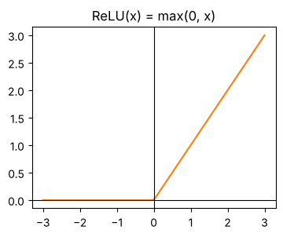
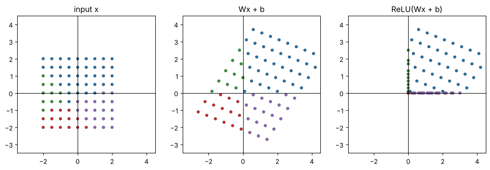
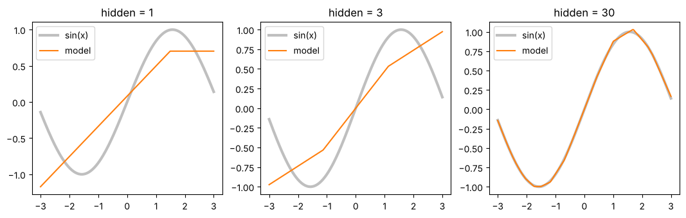

# 01-02 활성화 함수는 공간을 접어요

[](https://colab.research.google.com/github/alsrjs0725/EntryToPytorchForStudent/blob/main/notebooks/01-레이어-이론/02-활성화-함수는-공간을-접는다.ipynb)

선형 레이어만 여러 개 쌓으면 곧은 변환밖에 못 해요. 활성화 함수(activation function)는 공간을 접어서 휘어진 모양을 만들 수 있게 해요. 이 문서를 마치면 ReLU가 공간을 어떻게 접는지, 왜 레이어 사이에 꼭 필요한지 설명할 수 있어요.

**사전 지식:** [01-01 레이어는 공간을 바꾸는 함수예요](01-레이어는-공간을-바꾸는-함수.md)

## 1. 문제: 선형 레이어 두 개는 하나와 같아요

선형 레이어 두 개를 이어 붙이면 더 복잡한 일을 할 것 같아요. 그런데 식을 풀어 보면 선형 레이어 하나로 줄어들어요.

$$
W_2(W_1x + b_1) + b_2 = (W_2W_1)x + (W_2b_1 + b_2)
$$

코드로도 확인해요. 두 레이어를 합친 `W`, `b` 하나로 같은 결과가 나와요.

```python
layer1 = nn.Linear(2, 3)
layer2 = nn.Linear(3, 2)
x = torch.rand(5, 2)        # (5, 2)
y_two = layer2(layer1(x))   # (5, 2)

W = layer2.weight @ layer1.weight              # (2, 2)
b = layer2.weight @ layer1.bias + layer2.bias  # (2,)
y_one = x @ W.T + b                            # (5, 2)
print(torch.allclose(y_two, y_one, atol=1e-6))
```

```
True
```

선형 레이어를 100개 쌓아도 결국 평행사변형 변환 하나예요. 원 모양 경계 같은 휘어진 패턴은 만들 수 없어요.

## 2. 아이디어: 레이어 사이에서 공간을 접기

선형 레이어 사이에 **선형이 아닌** 함수를 끼우면 이 문제가 풀려요. 가장 많이 쓰는 활성화 함수는 ReLU(Rectified Linear Unit)예요. 음수는 0으로 바꾸고, 양수는 그대로 둬요.

$$
\text{ReLU}(x) = \max(0, x)
$$

{ width="350" }

```python
print(torch.relu(torch.tensor([-2.0, -0.5, 0.0, 1.5, 3.0])))
```

```
tensor([0.0000, 0.0000, 0.0000, 1.5000, 3.0000])
```

## 3. 결과 확인: ReLU를 2차원 점에 적용하기

01-01과 같은 선형 레이어(`W`, `b`)에 점 81개를 통과시키고, 이어서 ReLU를 적용해요.

```python
xs = torch.linspace(-2, 2, 9)
grid = torch.cartesian_prod(xs, xs)  # (81, 2), -2~2 사이를 0.5 간격으로
h = grid @ W.T + b   # (81, 2), 선형 레이어
r = torch.relu(h)    # (81, 2), 활성화 함수
```

<video src="../../videos/01-레이어-이론/relu_fold.mp4" controls autoplay loop muted playsinline width="600"></video>

선형 레이어를 지난 뒤(`Wx + b`) 점이 어느 사분면에 있었는지로 색을 칠했어요.



- 오른쪽 위(파랑) 38개는 두 좌표가 모두 양수라 그대로 있어요.
- x 좌표만 음수인 점(초록) 10개는 y축 위로, y 좌표만 음수인 점(보라) 19개는 x축 위로 접혀요.
- 두 좌표가 모두 음수인 점(빨강) 14개는 원점 한 곳으로 모여요.

공간이 종이처럼 축을 따라 접혔어요. 이렇게 접는 동작은 행렬 곱으로 만들 수 없어요. 그래서 "선형 레이어 → ReLU → 선형 레이어"는 선형 레이어 하나로 줄어들지 않아요.

## 4. 꺾인 선을 더해 곡선 만들기

1차원에서 보면 더 분명해요. "선형 레이어(1 → n) → ReLU → 선형 레이어(n → 1)" 모델은 꺾인 선 n개를 더한 함수예요. 꺾인 선이 많을수록 어떤 곡선이든 흉내 낼 수 있어요.

`sin(x)` 곡선을 따라 하도록 Adam 옵티마이저로 학습시킨 결과예요. Adam은 파라미터마다 학습률을 따로 조절하는 옵티마이저예요. 경사 하강법과 옵티마이저는 [01-03](03-손실과-경사-하강법.md)과 [01-04](04-학습-루프로-분류-모델-만들기.md)에서 다루니, 여기서는 결과만 봐요.



```
꺾인 선  1개: 손실 0.1338
꺾인 선  3개: 손실 0.1187
꺾인 선 30개: 손실 0.0001
```

손실(loss)은 예측이 정답과 얼마나 다른지 나타내는 숫자예요. 작을수록 잘 맞아요. 꺾인 선이 30개면 거의 완벽하게 맞아요.

## 정리

- 선형 레이어만 쌓으면 선형 레이어 하나와 같아요.
- ReLU는 음수를 0으로 바꿔 공간을 축을 따라 접어요.
- 선형 레이어 사이에 활성화 함수를 끼우면 휘어진 패턴을 만들 수 있어요.

**다음 문서:** [01-03 손실과 경사 하강법](03-손실과-경사-하강법.md)
