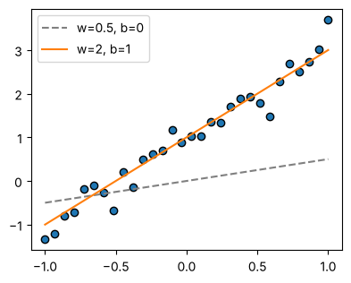
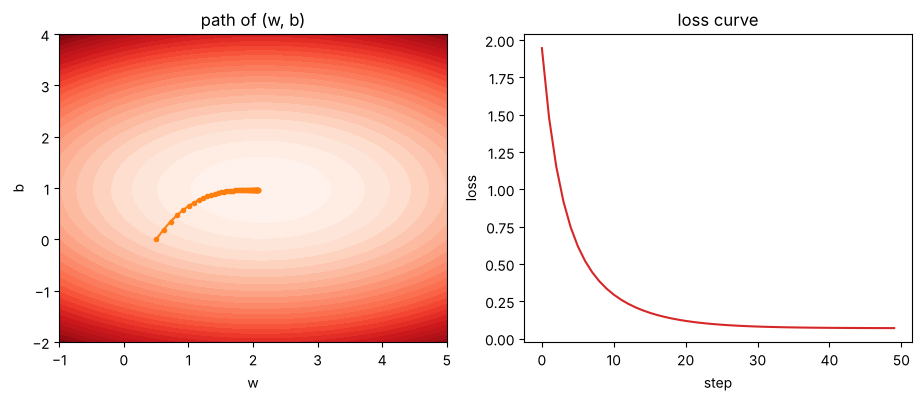
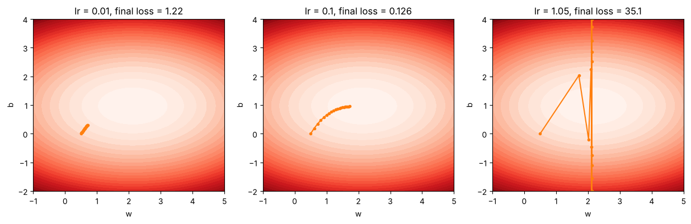

# 01-03 손실과 경사 하강법

[](https://colab.research.google.com/github/alsrjs0725/EntryToPytorchForStudent/blob/main/notebooks/01-레이어-이론/03-손실과-경사-하강법.ipynb)

레이어의 가중치는 사람이 정하지 않아요. 데이터를 보고 스스로 찾아요. 이 문서를 마치면 손실(loss)로 예측이 얼마나 틀렸는지 재고, 기울기(gradient)를 따라 가중치를 고치는 경사 하강법(gradient descent)을 설명할 수 있어요.

**사전 지식:** [01-01 레이어는 공간을 바꾸는 함수예요](01-레이어는-공간을-바꾸는-함수.md)

## 1. 문제: 좋은 가중치를 어떻게 찾을까요

가장 단순한 레이어로 시작해요. 입력과 출력이 숫자 하나인 `y = wx + b`예요. 데이터는 `y = 2x + 1` 근처에 흩어진 점 30개예요.

```python
x = torch.linspace(-1, 1, 30)              # (30,)
y = 2 * x + 1 + 0.3 * torch.randn(30)      # (30,)
```

{ width="400" }

회색 점선(`w=0.5, b=0`)보다 주황 직선(`w=2, b=1`)이 데이터에 잘 맞아요. 눈으로는 알겠는데, 컴퓨터가 판단하려면 "얼마나 잘 맞는지"를 숫자로 바꿔야 해요.

## 2. 손실: 틀린 정도를 숫자 하나로

예측과 정답의 차이를 제곱해서 평균 낸 값을 평균 제곱 오차(MSE, mean squared error)라고 해요. 손실 함수로 많이 써요.

$$
L = \frac{1}{N}\sum_{i=1}^{N} (wx_i + b - y_i)^2
$$

```python
def mse(w, b):
    return ((w * x + b - y) ** 2).mean()

print("w=0.5, b=0 손실:", mse(0.5, 0.0).item())
print("w=2.0, b=1 손실:", mse(2.0, 1.0).item())
```

```
w=0.5, b=0 손실: 1.9464174509048462
w=2.0, b=1 손실: 0.07612250745296478
```

잘 맞는 직선일수록 손실이 작아요. 이제 목표는 "손실이 가장 작은 `w`, `b` 찾기"예요.

`w`, `b`를 바꿔 가며 손실을 그려 보면 그릇 모양이 나와요. 먼저 `b`를 고정하고 `w`에 따른 손실 곡선을 그려요. `b`를 바꿔 가며 곡선을 계속 그리고, 그 곡선들을 `b` 순서대로 쌓으면 손실 곡면이 돼요. 곡면을 위에서 내려다보면 지도가 돼요. 색이 옅을수록 손실이 작아요.

<video src="../../videos/01-레이어-이론/loss_surface.mp4" controls autoplay loop muted playsinline width="600"></video>

## 3. 기울기: 어느 쪽으로 가야 손실이 줄어들까

그릇 바닥을 찾으려면 지금 위치에서 어느 쪽이 내리막인지 알아야 해요. 그 정보가 기울기예요. `w`를 아주 조금 늘렸을 때 손실이 얼마나 바뀌는지를 뜻해요.

가장 쉬운 방법은 직접 해 보는 거예요. `w`를 조금 늘려 보고 조금 줄여 봐서, 손실이 줄어드는 쪽을 고르면 돼요. `b`도 똑같이 해요. 아래 영상에서 초록 화살표가 손실이 줄어드는 방향이에요. 방향을 찾으면 학습률(`lr`)만큼 옮기고, 이를 되풀이해요.

<video src="../../videos/01-레이어-이론/nudge_descent.mp4" controls autoplay loop muted playsinline width="600"></video>

실제로는 하나씩 해 보지 않아요. 미분으로 모든 파라미터의 방향을 한 번에 구해요.

PyTorch는 기울기를 자동으로 계산해요. 텐서에 `requires_grad=True`를 붙이고, 손실에서 `backward()`를 부르면 `.grad`에 기울기가 채워져요. 이 과정을 역전파(backpropagation)라고 해요.

```python
w = torch.tensor(0.5, requires_grad=True)
b = torch.tensor(0.0, requires_grad=True)

loss = mse(w, b)
loss.backward()
print("w.grad:", w.grad.item())
print("b.grad:", b.grad.item())
```

```
w.grad: -1.157171607017517
b.grad: -1.9362618923187256
```

정말 맞는지 `w`를 0.001만큼 움직여 직접 확인해요. 같은 값이 나와요.

```python
eps = 1e-3
numeric = (mse(0.5 + eps, 0.0) - mse(0.5 - eps, 0.0)) / (2 * eps)
print("숫자로 구한 기울기:", numeric.item())
```

```
숫자로 구한 기울기: -1.1571645736694336
```

기울기가 음수라는 건 "`w`를 늘리면 손실이 줄어든다"는 뜻이에요.

## 4. 경사 하강법: 기울기 반대 방향으로 조금씩

경사 하강법은 기울기의 반대 방향으로 조금씩 움직이기를 되풀이해요. 얼마나 움직일지는 학습률(learning rate, `lr`)로 정해요.

$$
w \leftarrow w - \text{lr} \times \frac{\partial L}{\partial w}
$$

```python
lr = 0.1
w = torch.tensor(0.5, requires_grad=True)  # 앞에서 구한 기울기가 남지 않도록 다시 만들어요
b = torch.tensor(0.0, requires_grad=True)
for step in range(50):
    loss = mse(w, b)
    loss.backward()
    with torch.no_grad():   # 파라미터를 고치는 계산은 기록하지 않아요
        w -= lr * w.grad
        b -= lr * b.grad
    w.grad.zero_()          # 기울기는 누적되므로 매번 0으로 지워요
    b.grad.zero_()
```

`lr=0.1`로 50번 움직인 결과예요.

```
step  0: w=0.500, b=0.000, loss=1.9464
step 10: w=1.349, b=0.864, loss=0.2946
step 20: w=1.754, b=0.957, loss=0.1186
step 49: w=2.080, b=0.968, loss=0.0703
```

`w`, `b`가 정답에 가까운 2와 1로 다가갔어요. 손실 지도 위에 지나온 길을 그리면 그릇 바닥으로 내려가는 모습이 보여요.



!!! note "왜 `grad.zero_()`를 할까요"
    PyTorch는 `backward()`를 부를 때마다 기울기를 `.grad`에 **더해요**. 지우지 않으면 이전 단계의 기울기가 쌓여서 엉뚱한 방향으로 움직여요.

## 5. 학습률이 너무 작거나 크면

학습률은 사람이 정하는 값이에요. 20번만 움직이고 비교해 보면 차이가 커요.



- `lr=0.01`: 너무 조금씩 움직여서 바닥에 한참 못 미쳐요. (손실 1.22)
- `lr=0.1`: 바닥 근처에 도착해요. (손실 0.126)
- `lr=1.05`: 너무 크게 움직여서 바닥을 지나쳐 튕겨 나가요. 손실이 오히려 커져요. (손실 35.1)

학습이 안 될 때 가장 먼저 의심할 값이 학습률이에요.

## 정리

- 손실은 예측이 얼마나 틀렸는지 나타내는 숫자 하나예요.
- `loss.backward()`로 손실을 줄이는 방향(기울기)을 구해요.
- 경사 하강법은 기울기 반대 방향으로 학습률만큼 움직이기를 되풀이해요.

**다음 문서:** [01-04 학습 루프로 분류 모델 만들기](04-학습-루프로-분류-모델-만들기.md)
