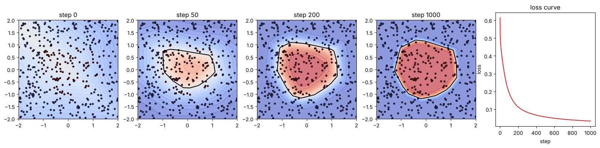
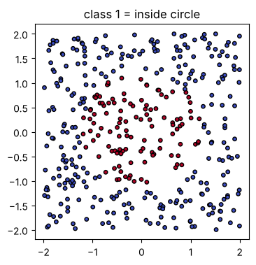
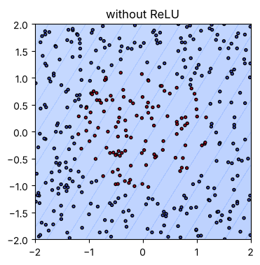

# 01-04 학습 루프로 분류 모델 만들기

[](https://colab.research.google.com/github/alsrjs0725/EntryToPytorchForStudent/blob/main/notebooks/01-레이어-이론/04-학습-루프로-분류-모델-만들기.ipynb)

앞 문서의 레이어, 활성화 함수, 손실, 경사 하강법을 하나로 묶어요. 이 문서를 마치면 "순전파 → 손실 → 역전파 → 경사 하강법" 학습 루프를 직접 짜고, 학습하면서 결정 경계가 바뀌는 모습을 그릴 수 있어요.

**사전 지식:** [01-02 활성화 함수](02-활성화-함수는-공간을-접는다.md), [01-03 손실과 경사 하강법](03-손실과-경사-하강법.md)

완성된 모델은 이렇게 학습해요. 왼쪽부터 학습 0, 50, 200, 1000단계의 결정 경계(검은 선)와 손실 곡선이에요.



## 1. 데이터: 원 안쪽과 바깥쪽

-2부터 2 사이의 점 400개를 만들고, 원 안쪽이면 1(빨강), 바깥쪽이면 0(파랑)으로 정답을 붙여요. 모델은 점의 좌표를 보고 원 안쪽인지 맞혀야 해요. 이렇게 정답 종류(클래스) 중 하나를 고르는 문제를 분류(classification)라고 해요.

```python
X = torch.rand(400, 2) * 4 - 2              # (400, 2)
Y = ((X ** 2).sum(dim=1) < 1.5).float()     # (400,), 원 안쪽이면 1
X, Y = X.to(device), Y.to(device)
```

{ width="350" }

## 2. 모델: 선형 → ReLU → 선형

입력 2개를 16개로 늘리는 선형 레이어, ReLU, 다시 1개로 줄이는 선형 레이어를 이어요. 가운데 16개짜리 값을 내는 레이어를 은닉 레이어(hidden layer)라고 불러요. 파라미터(parameter)는 학습으로 바뀌는 값, 즉 가중치와 편향이에요.

```python
def init_params(hidden=16):
    torch.manual_seed(0)
    params = {
        "W1": torch.randn(hidden, 2) * 0.5,  # (16, 2)
        "b1": torch.zeros(hidden),           # (16,)
        "W2": torch.randn(1, hidden) * 0.5,  # (1, 16)
        "b2": torch.zeros(1),                # (1,)
    }
    return {k: v.to(device).requires_grad_() for k, v in params.items()}

def model(x, p):
    h = torch.relu(x @ p["W1"].T + p["b1"])  # (N, 16)
    logit = h @ p["W2"].T + p["b2"]          # (N, 1)
    return logit.squeeze(1)                  # (N,)
```

모델은 점마다 숫자 하나를 내요. 이 숫자를 로짓(logit)이라고 해요. 로짓은 범위가 정해지지 않은 점수라서, 시그모이드(sigmoid) 함수로 0과 1 사이의 확률로 바꿔요. 로짓이 0이면 확률 0.5, 클수록 1에 가까워요.

```python
print("확률로 바꾼 값:", torch.sigmoid(logit[:5]))
```

```
확률로 바꾼 값: tensor([0.4557, 0.4084, 0.5498, 0.4372, 0.5027], grad_fn=<SigmoidBackward0>)
```

학습 전이라 모두 0.5 근처예요. 아직 아무것도 모르는 상태예요.

## 3. 손실: 이진 교차 엔트로피

정답이 0 또는 1인 분류에는 이진 교차 엔트로피(binary cross entropy)를 손실로 써요. 정답에 준 확률을 `p`라고 하면 손실은 `-log(p)`예요. 정답을 확신할수록 0에 가깝고, 정답에 낮은 확률을 줄수록 크게 커져요.

```python
p = torch.tensor([0.9, 0.6, 0.1])  # 정답에 준 확률
print("-log(p):", (-torch.log(p)).tolist())
```

```
-log(p): [0.10536054521799088, 0.5108255743980408, 2.3025851249694824]
```

PyTorch의 `F.binary_cross_entropy_with_logits`는 시그모이드와 이 손실을 한 번에 계산해요.

## 4. 학습 루프

학습 루프는 다섯 단계를 반복해요.

```python
params = init_params()
lr = 0.5
for step in range(1001):
    logit = model(X, params)                              # 1. 순전파
    loss = F.binary_cross_entropy_with_logits(logit, Y)   # 2. 손실
    loss.backward()                                       # 3. 역전파
    with torch.no_grad():                                 # 4. 경사 하강법
        for v in params.values():
            v -= lr * v.grad
            v.grad.zero_()                                # 5. 기울기 지우기
```

1. **순전파(forward pass):** 입력을 모델에 통과시켜 예측을 내요.
2. **손실:** 예측과 정답을 비교해 숫자 하나로 만들어요.
3. **역전파:** 손실을 줄이는 방향(기울기)을 모든 파라미터에 대해 구해요.
4. **경사 하강법:** 기울기 반대 방향으로 파라미터를 조금 고쳐요.
5. **기울기 지우기:** 다음 단계를 위해 `.grad`를 0으로 만들어요.

```
step    0: loss=0.6146, acc=0.645
step  200: loss=0.1122, acc=0.988
step  400: loss=0.0667, acc=0.995
step  600: loss=0.0489, acc=0.995
step  800: loss=0.0392, acc=0.995
step 1000: loss=0.0328, acc=0.998
```

정확도(acc)는 로짓이 0보다 크면 1로 예측했을 때 정답과 같은 비율이에요. 1000단계 만에 99.8%를 맞혀요. 문서 맨 위 그림에서 결정 경계가 점점 원 모양을 찾아가는 모습을 볼 수 있어요. 경계가 매끈한 원이 아니라 각진 다각형인 이유는 ReLU가 공간을 직선으로 접기 때문이에요.

## 5. 활성화 함수를 빼면

같은 모델에서 ReLU만 빼고 학습해 봐요.

```
ReLU 없는 모델: loss=0.5996, acc=0.712
```

{ width="350" }

[01-02](02-활성화-함수는-공간을-접는다.md)에서 본 대로 선형 레이어만으로는 직선 경계밖에 못 그어요. 원 안쪽을 골라낼 수 없어요.

## 6. 같은 일을 하는 PyTorch 도구

4단계(경사 하강법)와 5단계(기울기 지우기)는 옵티마이저(optimizer)가 대신해 줘요. `torch.optim.SGD`는 방금 직접 짠 경사 하강법과 같은 계산을 해요.

```python
params = init_params()
optimizer = torch.optim.SGD(params.values(), lr=0.5)
for step in range(1001):
    loss = F.binary_cross_entropy_with_logits(model(X, params), Y)
    optimizer.zero_grad()  # 기울기 지우기
    loss.backward()        # 역전파
    optimizer.step()       # 경사 하강법
```

```
optimizer 사용: loss=0.0328 (직접 구현: 0.0328)
```

결과가 같아요. 다음 챕터부터는 옵티마이저를 써요.

## 자주 묻는 질문

??? question "손실이 줄지 않아요"
    학습률부터 확인해요. 너무 크면 손실이 오르내리거나 커지고, 너무 작으면 거의 변하지 않아요. `zero_grad()`를 빠뜨려도 학습이 이상해져요.

??? question "`with torch.no_grad()`를 빼면 어떻게 되나요"
    파라미터를 고치는 계산까지 기록되면서 오류가 나요. 파라미터를 직접 고칠 때는 꼭 이 블록 안에서 해요.

## 정리

- 학습 루프는 순전파 → 손실 → 역전파 → 경사 하강법 → 기울기 지우기의 반복이에요.
- 분류에서는 로짓을 확률로 바꾸고, 교차 엔트로피를 손실로 써요.
- 옵티마이저는 경사 하강법과 기울기 지우기를 대신해 줘요.

**다음 문서:** [02-01 nn.Module로 모델 만들기](../02-레이어-실제-구조와-종류/01-nn-module로-모델-만들기.md)
