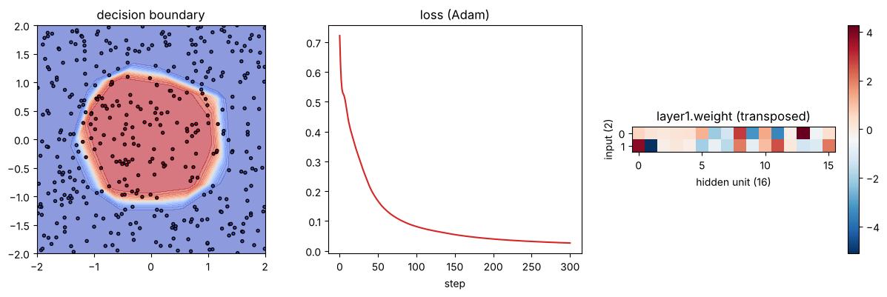

# 02-01 nn.Module로 모델 만들기

[](https://colab.research.google.com/github/alsrjs0725/EntryToPytorchForStudent/blob/main/notebooks/02-레이어-실제-구조와-종류/01-nn-module로-모델-만들기.ipynb)

[01-04](../01-레이어-이론/04-학습-루프로-분류-모델-만들기.md)에서는 가중치를 딕셔너리에 직접 담았어요. 레이어가 많아지면 이 방식은 관리하기 어려워요. PyTorch는 모델을 `nn.Module` 클래스로 만들어요. 이 문서를 마치면 `nn.Module`로 모델 클래스를 만들고, 파라미터를 살펴보고, 옵티마이저로 학습시킬 수 있어요.

**사전 지식:** [01-04 학습 루프로 분류 모델 만들기](../01-레이어-이론/04-학습-루프로-분류-모델-만들기.md), 파이썬 클래스

## 1. 01-04의 모델을 클래스로 옮기기

`nn.Module`을 상속한 클래스는 두 메서드를 가져요.

- `__init__`: 쓸 레이어를 만들어 속성에 담아요. 맨 앞에서 `super().__init__()`을 꼭 불러요.
- `forward`: 입력이 레이어를 어떤 순서로 지나는지 적어요.

```python
class CircleClassifier(nn.Module):
    def __init__(self, hidden=16):
        super().__init__()
        self.layer1 = nn.Linear(2, hidden)
        self.layer2 = nn.Linear(hidden, 1)

    def forward(self, x):
        # x: (batch, 2)
        h = torch.relu(self.layer1(x))  # (batch, hidden)
        logit = self.layer2(h)          # (batch, 1)
        return logit.squeeze(1)         # (batch,)

model = CircleClassifier()
print(model)
```

```
CircleClassifier(
  (layer1): Linear(in_features=2, out_features=16, bias=True)
  (layer2): Linear(in_features=16, out_features=1, bias=True)
)
```

모델은 `model.forward(x)`가 아니라 `model(x)`로 불러요. `model(x)`는 `forward`를 부르기 전후에 PyTorch가 필요한 일을 함께 처리해요.

## 2. 파라미터 살펴보기

속성에 담은 레이어의 파라미터는 `nn.Module`이 자동으로 모아요. `named_parameters()`로 이름과 함께 꺼낼 수 있어요.

```python
for name, p in model.named_parameters():
    print(f"{name:15s} {tuple(p.shape)}  requires_grad={p.requires_grad}")
print("전체 파라미터 수:", sum(p.numel() for p in model.parameters()))
```

```
layer1.weight   (16, 2)  requires_grad=True
layer1.bias     (16,)  requires_grad=True
layer2.weight   (1, 16)  requires_grad=True
layer2.bias     (1,)  requires_grad=True
전체 파라미터 수: 65
```

01-04에서 직접 만든 `W1`, `b1`, `W2`, `b2`와 모양이 같아요. `requires_grad=True`도 자동으로 붙어 있어요.

## 3. GPU로 옮기고 옵티마이저로 학습하기

`model.to(device)` 한 줄로 모든 파라미터가 GPU로 옮겨져요. 옵티마이저에는 `model.parameters()`를 넘겨요.

이번에는 `SGD` 대신 Adam 옵티마이저를 써요. Adam은 파라미터마다 움직이는 크기를 알아서 조절해서, 학습률을 덜 신경 써도 잘 학습돼요. 이 튜토리얼은 이후로 주로 Adam을 써요.

```python
model = CircleClassifier().to(device)
optimizer = torch.optim.Adam(model.parameters(), lr=0.05)

for step in range(301):
    loss = F.binary_cross_entropy_with_logits(model(X), Y)
    optimizer.zero_grad()
    loss.backward()
    optimizer.step()
```

```
step   0: loss=0.7221
step 100: loss=0.0815
step 200: loss=0.0397
step 300: loss=0.0263
```

01-04의 SGD는 1000단계에서 손실 0.0328이었어요. Adam은 300단계 만에 더 낮아졌어요.

## 4. 학습된 레이어 들여다보기

레이어는 속성 이름으로 꺼내요. `model.layer1.weight`는 첫 번째 선형 레이어의 가중치예요.



오른쪽 히트맵의 열 하나는 은닉 유닛 하나예요. 유닛마다 입력 두 개를 다른 비율로 섞어서, 평면을 서로 다른 방향의 직선으로 나눠요. 이 직선들을 ReLU로 접고 더해서 왼쪽의 원 모양 경계를 만들어요.

## 5. 저장하고 불러오기

`state_dict()`는 파라미터 이름과 값을 담은 딕셔너리예요. 이걸 파일로 저장하고, 같은 클래스로 만든 모델에 불러와요.

```python
torch.save(model.state_dict(), "circle.pt")
loaded = CircleClassifier().to(device)
loaded.load_state_dict(torch.load("circle.pt"))
print(torch.allclose(loaded(X), model(X)))
```

```
True
```

## 자주 묻는 질문

??? question "`AttributeError: cannot assign module before Module.__init__() call`이 나요"
    `__init__` 맨 앞의 `super().__init__()`을 빠뜨렸어요.

??? question "레이어를 파이썬 리스트에 담았더니 파라미터 수가 0이에요"
    `nn.Module`은 속성에 직접 담은 레이어만 찾아요. 여러 레이어를 리스트로 담으려면 `nn.ModuleList`를 써요. [02-05](05-레이어를-쌓아-모델-만들기.md)에서 다뤄요.

## 정리

- 모델은 `nn.Module`을 상속해 `__init__`에서 레이어를 만들고 `forward`에서 순서를 적어요.
- `model.parameters()`로 파라미터를 모아 옵티마이저에 넘기고, `model.to(device)`로 GPU에 옮겨요.
- `state_dict()`로 학습한 파라미터를 저장하고 불러와요.

**다음 문서:** [02-02 활성화 함수와 소프트맥스](02-활성화-함수와-소프트맥스.md)
