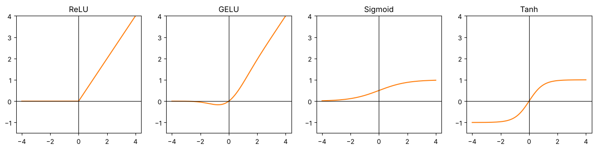
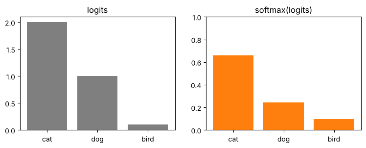
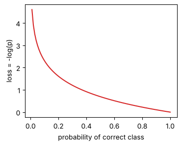

# 02-02 활성화 함수와 소프트맥스

[](https://colab.research.google.com/github/alsrjs0725/EntryToPytorchForStudent/blob/main/notebooks/02-레이어-실제-구조와-종류/02-활성화-함수와-소프트맥스.ipynb)

ReLU 말고도 자주 쓰는 활성화 함수가 몇 가지 있어요. 그리고 클래스가 여러 개인 분류에서는 점수를 확률로 바꾸는 소프트맥스(softmax)를 써요. 이 문서를 마치면 활성화 함수의 모양을 구분하고, 소프트맥스와 교차 엔트로피 손실로 여러 클래스 분류의 출력을 다룰 수 있어요.

**사전 지식:** [01-02 활성화 함수는 공간을 접어요](../01-레이어-이론/02-활성화-함수는-공간을-접는다.md), [01-04의 이진 교차 엔트로피](../01-레이어-이론/04-학습-루프로-분류-모델-만들기.md)

## 1. 자주 쓰는 활성화 함수



| 함수 | 출력 범위 | 특징 | 이 튜토리얼에서 쓰는 곳 |
| --- | --- | --- | --- |
| `nn.ReLU` | 0 이상 | 음수를 0으로. 가장 단순하고 빨라요 | 01, 02 챕터 |
| `nn.GELU` | 약 -0.17 이상 | ReLU를 부드럽게 만든 모양. 0 근처 음수를 조금 남겨요 | 트랜스포머(04~06) |
| `nn.Sigmoid` | 0~1 | 값을 확률로 바꿀 때 써요 | 이진 분류 출력 |
| `nn.Tanh` | -1~1 | 0을 중심으로 눌러요 | (참고) |

같은 입력에 적용한 값이에요.

```
입력       [-2.0, -0.5, 0.0, 0.5, 2.0]
ReLU     [0.0, 0.0, 0.0, 0.5, 2.0]
GELU     [-0.046, -0.154, 0.0, 0.346, 1.954]
Sigmoid  [0.119, 0.378, 0.5, 0.622, 0.881]
Tanh     [-0.964, -0.462, 0.0, 0.462, 0.964]
```

어떤 활성화 함수든 하는 일은 같아요. 선형 레이어 사이에서 공간을 휘거나 접어요.

## 2. 소프트맥스: 점수를 확률로

고양이, 개, 새 중 하나를 고르는 모델은 클래스마다 점수(로짓)를 하나씩, 모두 3개 내요. 로짓은 음수일 수도 있고 합이 1도 아니에요. 소프트맥스는 이 점수를 합이 1인 확률로 바꿔요.

$$
\text{softmax}(z)_i = \frac{e^{z_i}}{\sum_j e^{z_j}}
$$

모든 점수에 지수 함수 `exp`를 적용해 양수로 만들고, 전체 합으로 나눠요.

```python
logits = torch.tensor([2.0, 1.0, 0.1])
probs = torch.exp(logits) / torch.exp(logits).sum()
print("직접 계산:", probs)
print("F.softmax:", F.softmax(logits, dim=-1))
```

```
직접 계산: tensor([0.6590, 0.2424, 0.0986])
F.softmax: tensor([0.6590, 0.2424, 0.0986])
```

{ width="600" }

점수 순서는 그대로 두고, 큰 점수는 더 크게 벌려요. 지수 함수 때문이에요.

배치로 계산할 때는 `dim=-1`(마지막 축)을 따라 소프트맥스를 해요. 샘플마다 클래스 점수가 마지막 축에 있기 때문이에요.

```python
batch_logits = torch.randn(4, 3)          # (batch=4, 클래스=3)
p = F.softmax(batch_logits, dim=-1)       # (4, 3)
print(p.sum(dim=-1))
```

```
tensor([1.0000, 1.0000, 1.0000, 1.0000])
```

## 3. 교차 엔트로피 손실

클래스가 여러 개일 때도 손실은 01-04와 같은 생각이에요. **정답 클래스에 준 확률 `p`의 `-log(p)`** 예요. 이걸 교차 엔트로피(cross entropy)라고 해요.

{ width="350" }

`F.cross_entropy`(또는 `nn.CrossEntropyLoss`)는 소프트맥스와 `-log`를 한 번에 계산해요. 그래서 **모델 출력에 소프트맥스를 하지 않고 로짓을 그대로** 넣어요. 정답은 클래스 번호(정수)로 줘요.

```python
target = torch.tensor(0)  # 정답은 0번 클래스(cat)
manual = -torch.log(probs[target])
builtin = F.cross_entropy(logits.unsqueeze(0), target.unsqueeze(0))  # (1, 3), (1,)
print(manual.item(), builtin.item())
```

```
0.41703006625175476 0.4170299470424652
```

배치에서는 로짓 `(batch, 클래스 수)`와 정답 `(batch,)`를 넣으면 평균 손실이 나와요.

```python
logits_b = torch.randn(4, 3)              # (batch=4, 클래스=3)
targets_b = torch.tensor([0, 2, 1, 2])    # (4,)
print(nn.CrossEntropyLoss()(logits_b, targets_b))
```

```
tensor(1.6562)
```

이 조합(로짓 → 교차 엔트로피)은 띄어쓰기 모델(05)과 LLM(06)에서도 그대로 써요. 띄어쓰기 모델은 "띄운다/안 띄운다" 2개 클래스, LLM은 "다음 글자가 어휘집의 몇 번인가" 수천 개 클래스를 고르는 분류예요.

## 정리

- 활성화 함수는 ReLU, GELU를 주로 쓰고, 모두 선형 레이어 사이에서 공간을 휘게 해요.
- 소프트맥스는 클래스별 점수를 합이 1인 확률로 바꿔요.
- `F.cross_entropy`에는 소프트맥스 전의 로짓과 정답 번호를 넣어요.

**다음 문서:** [02-03 임베딩 레이어](03-임베딩-레이어.md)
