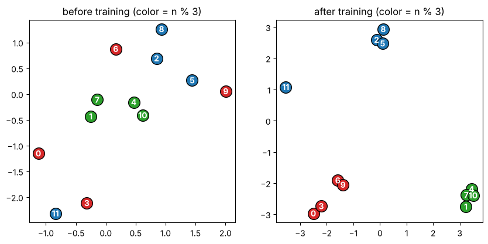
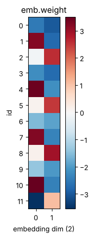

# 02-03 임베딩 레이어

[](https://colab.research.google.com/github/alsrjs0725/EntryToPytorchForStudent/blob/main/notebooks/02-레이어-실제-구조와-종류/03-임베딩-레이어.ipynb)

문장은 글자나 단어의 번호(정수)로 바뀌어 모델에 들어가요. 그런데 번호 자체는 크기에 의미가 없어서 선형 레이어에 바로 넣기 어려워요. 임베딩(embedding) 레이어는 번호마다 학습할 수 있는 벡터를 하나씩 붙여 줘요. 이 문서를 마치면 `nn.Embedding`이 하는 일과 입출력 모양을 설명할 수 있어요.

**사전 지식:** [02-01 nn.Module로 모델 만들기](01-nn-module로-모델-만들기.md), [02-02의 교차 엔트로피](02-활성화-함수와-소프트맥스.md)

## 1. 문제: 번호는 크기에 의미가 없어요

"고양이"가 3번, "강아지"가 7번이라고 해 봐요. 7이 3보다 크다고 강아지가 고양이보다 "더한" 것은 아니에요. 번호를 숫자로 그대로 넣으면 모델이 이런 엉뚱한 크기 관계를 배울 수 있어요.

## 2. 아이디어: 번호마다 벡터 하나

번호마다 벡터를 하나씩 준비해 두고, 번호가 들어오면 그 벡터를 꺼내요. 표에서 행을 찾아 꺼내는 것과 같아요. 벡터 값은 학습으로 정해져요.

```python
emb = nn.Embedding(num_embeddings=10, embedding_dim=4)  # 번호 10개, 벡터 길이 4
print(emb.weight.shape)   # (10, 4)

ids = torch.tensor([3, 7, 3])  # (3,)
vectors = emb(ids)             # (3, 4)
print(torch.equal(vectors[0], emb.weight[3]))  # 3번 행을 그대로 꺼내요
```

```
torch.Size([10, 4])
True
```

`emb.weight`는 `(번호 개수, 벡터 길이)` 모양의 표예요. 같은 번호 3은 항상 같은 벡터가 돼요.

## 3. 원-핫 벡터 × 선형 레이어와 같아요

임베딩은 새로운 계산이 아니에요. 번호를 원-핫(one-hot) 벡터로 바꾸고 가중치 행렬을 곱한 것과 같아요. 원-핫 벡터는 그 번호 자리만 1이고 나머지는 0인 벡터예요.

```python
one_hot = F.one_hot(ids, num_classes=10).float()  # (3, 10)
via_matmul = one_hot @ emb.weight                 # (3, 10) @ (10, 4) = (3, 4)
print(torch.allclose(via_matmul, vectors))
```

```
True
```

1인 자리의 행만 남기 때문에 결과가 "행 꺼내기"와 같아요. 다만 원-핫 벡터는 거의 0이라 곱셈이 낭비예요. 그래서 `nn.Embedding`은 곱하지 않고 행을 바로 꺼내요. 결국 임베딩은 **편향 없는 선형 레이어를 빠르게 계산하는 방법**이에요.

## 4. 배치와 시퀀스

문장 여러 개를 한 번에 넣으면 모양이 `(batch, seq_len)`인 정수 텐서가 돼요. 임베딩은 정수 하나하나를 벡터로 바꿔서 마지막에 축을 하나 더해요.

```python
batch = torch.tensor([[1, 2, 3, 0], [4, 5, 0, 0]])  # (batch=2, seq_len=4)
out = emb(batch)                                    # (2, 4, 4)
print(out.shape)
```

```
torch.Size([2, 4, 4])
```

`(batch, seq_len)` → `(batch, seq_len, embedding_dim)`. 이 모양은 03 토크나이저부터 06 LLM까지 계속 나와요.

## 5. 임베딩도 학습돼요

작은 문제로 임베딩이 학습되는 모습을 봐요. 숫자 0~11을 받아 3으로 나눈 나머지(0, 1, 2)를 맞히는 문제예요. 숫자마다 2차원 임베딩을 주고, 선형 레이어로 클래스 3개를 골라요.

```python
class TinyClassifier(nn.Module):
    def __init__(self):
        super().__init__()
        self.emb = nn.Embedding(12, 2)   # 숫자마다 2차원 벡터
        self.out = nn.Linear(2, 3)

    def forward(self, ids):
        return self.out(self.emb(ids))   # (batch, 2) -> (batch, 3)
```

300단계 학습하면 손실이 0.0003까지 내려가요. 학습 전과 후의 임베딩을 평면에 찍어 봐요. 색은 3으로 나눈 나머지예요.



학습 전에는 무작위로 흩어져 있던 점이, 학습 뒤에는 나머지가 같은 숫자끼리 모였어요. 모델은 "3으로 나눈 나머지"라는 성질을 임베딩 공간의 위치로 표현하게 됐어요. 문자나 단어 임베딩도 같은 원리로, 비슷하게 쓰이는 토큰끼리 가까워져요.

{ width="250" }

## 정리

- `nn.Embedding(번호 개수, 벡터 길이)`는 번호마다 학습할 수 있는 벡터를 하나씩 붙여요.
- 원-핫 벡터에 가중치를 곱한 것과 같고, 행을 바로 꺼내서 빠르게 계산해요.
- 모양은 `(batch, seq_len)` → `(batch, seq_len, embedding_dim)`이에요.

**다음 문서:** [02-04 정규화와 드롭아웃](04-정규화와-드롭아웃.md)
