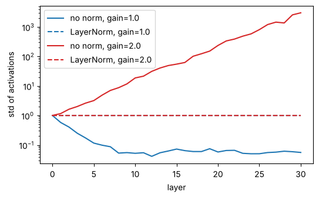
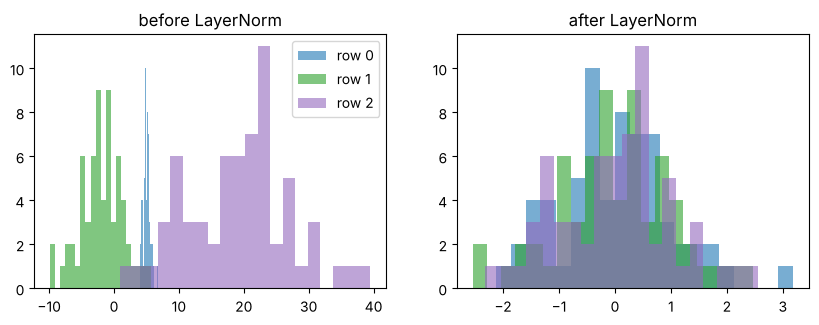
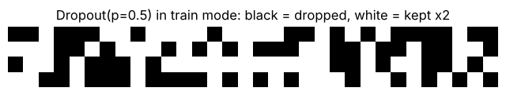

# 02-04 정규화와 드롭아웃

[](https://colab.research.google.com/github/alsrjs0725/EntryToPytorchForStudent/blob/main/notebooks/02-레이어-실제-구조와-종류/04-정규화와-드롭아웃.ipynb)

레이어를 깊게 쌓으면 학습이 불안정해지고, 모델이 학습 데이터만 외우기 쉬워요. 레이어 정규화(layer normalization)와 드롭아웃(dropout)은 이 두 문제를 줄이는 레이어예요. 파라미터는 거의 없지만 트랜스포머에 빠짐없이 들어가요. 이 문서를 마치면 두 레이어가 텐서를 어떻게 바꾸는지, 학습 모드와 평가 모드가 왜 다른지 설명할 수 있어요.

**사전 지식:** [02-01 nn.Module로 모델 만들기](01-nn-module로-모델-만들기.md)

## 1. 문제: 깊게 쌓으면 값의 크기가 흔들려요

선형 레이어와 ReLU를 30번 쌓고, 레이어를 지날 때마다 값의 표준편차(값이 퍼진 정도)를 재 봐요. 가중치를 조금 작게(gain=1.0), 조금 크게(gain=2.0) 시작한 두 경우를 비교해요.

```
gain=1.0: 첫 레이어 표준편차 0.579, 30번째 0.0559
gain=2.0: 첫 레이어 표준편차 1.16, 30번째 3.03e+03
```

{ width="550" }

실선을 보면 가중치가 조금만 작아도 값이 0으로 사라지고, 조금만 커도 수천 배로 커져요. 값이 이렇게 흔들리면 기울기도 함께 흔들려서 학습이 잘 안 돼요. 점선은 레이어마다 LayerNorm을 넣은 경우예요. 깊이와 상관없이 크기가 일정해요.

## 2. 레이어 정규화(LayerNorm)

LayerNorm은 마지막 축의 값들을 평균 0, 분산 1로 맞춰요. 샘플(행)마다 따로 계산해요.

$$
\text{LayerNorm}(x) = \frac{x - \text{평균}}{\sqrt{\text{분산} + \epsilon}} \times \gamma + \beta
$$

```python
x = torch.tensor([[1.0, 2.0, 3.0, 4.0], [10.0, 20.0, 30.0, 40.0]])  # (2, 4)
mean = x.mean(dim=-1, keepdim=True)                  # (2, 1)
var = x.var(dim=-1, keepdim=True, unbiased=False)    # (2, 1)
manual = (x - mean) / torch.sqrt(var + 1e-5)         # (2, 4)
print(manual)
print(nn.LayerNorm(4)(x))
```

```
tensor([[-1.3416, -0.4472,  0.4472,  1.3416],
        [-1.3416, -0.4472,  0.4472,  1.3416]])
tensor([[-1.3416, -0.4472,  0.4472,  1.3416],
        [-1.3416, -0.4472,  0.4472,  1.3416]],
       grad_fn=<NativeLayerNormBackward0>)
```

두 행은 크기가 10배 차이 나지만, 정규화하면 같아져요. 값의 절대 크기는 지우고 상대적인 모양만 남겨요. `γ`(`ln.weight`)와 `β`(`ln.bias`)는 학습하는 배율과 이동값이에요. 처음에는 1과 0이라서 아무 일도 안 해요.

평균과 퍼진 정도가 전혀 다른 세 행을 정규화하면 모두 같은 범위로 모여요.



`nn.LayerNorm(d)`의 입출력 모양은 같아요. `(batch, seq_len, d)`가 들어가면 `(batch, seq_len, d)`가 나와요.

## 3. 드롭아웃

드롭아웃은 학습할 때 값의 일부를 무작위로 0으로 만들어요. 매번 다른 일부가 꺼지니까, 모델은 특정 값 몇 개에만 기대지 못하고 여러 값을 골고루 써야 해요. 그래서 학습 데이터를 외우는 현상(과적합, overfitting)이 줄어요.

```python
drop = nn.Dropout(p=0.5)
x = torch.ones(2, 8)  # (2, 8)

drop.train()   # 학습 모드
print(drop(x))
drop.eval()    # 평가 모드
print(drop(x))
```

```
tensor([[0., 0., 2., 0., 0., 0., 2., 2.],
        [0., 2., 2., 2., 2., 0., 2., 2.]])
tensor([[1., 1., 1., 1., 1., 1., 1., 1.],
        [1., 1., 1., 1., 1., 1., 1., 1.]])
```



- 학습 모드에서는 절반(`p=0.5`)이 0이 되고, 남은 값은 2배(`1 / (1 - p)`)가 돼요. 평균을 그대로 유지하려고 키워요.
- 평가 모드에서는 아무것도 하지 않아요.

값 1만 개로 확인하면 0이 된 비율은 약 0.5, 평균은 약 1이에요.

```
평균(학습 모드): 0.9940000176429749
0이 된 비율: 0.5099999904632568
```

## 4. `model.train()`과 `model.eval()`

드롭아웃처럼 학습할 때와 평가할 때 다르게 동작하는 레이어가 있어요. 모델 전체를 바꾸려면 `model.train()`, `model.eval()`을 불러요. 안에 든 모든 레이어의 모드가 함께 바뀌어요.

```python
model = nn.Sequential(nn.Linear(4, 4), nn.Dropout(0.5), nn.LayerNorm(4))
x = torch.ones(1, 4)
model.train()
print(model(x))
print(model(x))  # 매번 다르게 꺼져요
model.eval()
print(model(x))
print(model(x))  # 항상 같아요
```

```
tensor([[-1.3005, -0.2554,  0.0592,  1.4967]], ...)
tensor([[-1.1161, -0.3949, -0.0980,  1.6090]], ...)
tensor([[-1.1912, -0.4710,  0.1318,  1.5303]], ...)
tensor([[-1.1912, -0.4710,  0.1318,  1.5303]], ...)
```

!!! warning "평가와 생성 전에는 꼭 `model.eval()`"
    평가 모드로 바꾸지 않으면 드롭아웃이 계속 값을 꺼뜨려서, 정확도가 낮게 나오고 결과가 매번 달라져요. 다시 학습할 때는 `model.train()`으로 돌려요.

## 정리

- LayerNorm은 마지막 축을 평균 0, 분산 1로 맞춰 깊은 모델에서도 값의 크기를 일정하게 지켜요.
- 드롭아웃은 학습할 때만 값 일부를 0으로 만들어 과적합을 줄여요.
- 평가와 생성 전에는 `model.eval()`, 학습 전에는 `model.train()`을 불러요.

**다음 문서:** [02-05 레이어를 쌓아 모델 만들기](05-레이어를-쌓아-모델-만들기.md)
