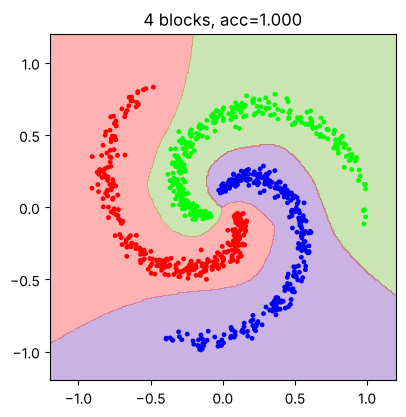
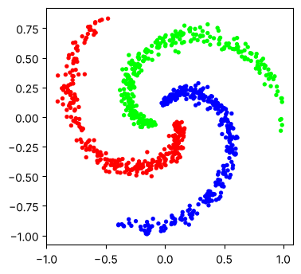
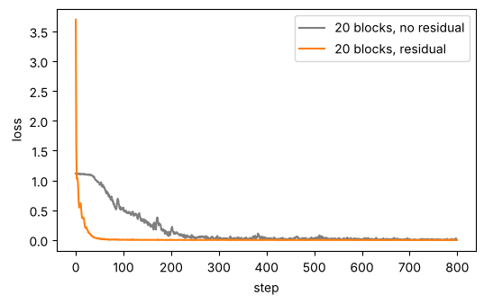

# 02-05 레이어를 쌓아 모델 만들기

[](https://colab.research.google.com/github/alsrjs0725/EntryToPytorchForStudent/blob/main/notebooks/02-레이어-실제-구조와-종류/05-레이어를-쌓아-모델-만들기.ipynb)

지금까지 레이어를 하나씩 살펴봤어요. 실제 모델은 이 레이어들을 여러 겹 쌓은 거예요. 이 문서를 마치면 `nn.Sequential`과 `nn.ModuleList`로 레이어를 쌓고, 정규화·드롭아웃·잔차 연결을 묶은 블록을 만들어 모델 클래스로 조립할 수 있어요. 각 레이어의 입출력 모양도 설명할 수 있어요.

**사전 지식:** [02-01](01-nn-module로-모델-만들기.md) ~ [02-04](04-정규화와-드롭아웃.md)

완성한 모델은 나선 세 개를 이렇게 구분해요.

{ width="400" }

## 1. 데이터: 나선 세 개

원 하나보다 어려운 문제로 바꿔요. 세 클래스의 점이 나선 모양으로 감겨 있어요. 경계가 여러 번 휘어서 레이어를 깊게 쌓아야 풀려요.

{ width="350" }

```python
X, Y = make_spirals()  # (900, 2), (900,), 클래스 0, 1, 2
```

클래스가 3개라서 출력은 클래스별 로짓 3개이고, 손실은 [02-02의 교차 엔트로피](02-활성화-함수와-소프트맥스.md)를 써요.

## 2. `nn.Sequential`로 쌓기

레이어를 순서대로 통과시키기만 하면 될 때는 `nn.Sequential`에 넣어요. `forward`를 따로 쓰지 않아도 돼요.

```python
model = nn.Sequential(
    nn.Linear(2, 64),   # (batch, 2) -> (batch, 64)
    nn.ReLU(),
    nn.Linear(64, 64),  # (batch, 64) -> (batch, 64)
    nn.ReLU(),
    nn.Linear(64, 3),   # (batch, 64) -> (batch, 3)
)
```

`nn.Sequential`은 반복문으로 레이어를 하나씩 꺼낼 수 있어요. 레이어마다 출력 모양을 찍어 보면 데이터가 어떻게 흘러가는지 보여요.

```python
x = torch.rand(5, 2)
for layer in model:
    x = layer(x)
    print(f"{layer.__class__.__name__:8s} -> {tuple(x.shape)}")
```

```
Linear   -> (5, 64)
ReLU     -> (5, 64)
Linear   -> (5, 64)
ReLU     -> (5, 64)
Linear   -> (5, 3)
```

선형 레이어는 마지막 축의 크기를 바꾸고, ReLU는 모양을 그대로 둬요. 모양을 따라가는 이 습관은 04 트랜스포머에서 큰 도움이 돼요.

## 3. 블록 만들기: 정규화, 드롭아웃, 잔차 연결

같은 묶음을 여러 번 쌓을 때는 그 묶음을 블록(block) 클래스로 만들어요. 이 블록은 세 가지를 합쳐요.

- **LayerNorm:** 값의 크기를 일정하게 지켜요. ([02-04](04-정규화와-드롭아웃.md))
- **드롭아웃:** 과적합을 줄여요. ([02-04](04-정규화와-드롭아웃.md))
- **잔차 연결(residual connection):** 블록의 출력에 입력을 그대로 더해요. `x + f(x)`예요. 블록은 입력을 통째로 바꾸지 않고 "고칠 만큼만" 더해요.

```python
class Block(nn.Module):
    """LayerNorm -> Linear -> ReLU -> Dropout, 그리고 입력을 더하는 블록"""

    def __init__(self, d, dropout=0.1, residual=True):
        super().__init__()
        self.norm = nn.LayerNorm(d)
        self.linear = nn.Linear(d, d)
        self.dropout = nn.Dropout(dropout)
        self.residual = residual

    def forward(self, x):
        # x: (batch, d)
        h = self.dropout(torch.relu(self.linear(self.norm(x))))  # (batch, d)
        return x + h if self.residual else h                     # (batch, d)
```

잔차 연결로 더하려면 입력과 출력의 모양이 같아야 해요. 그래서 블록은 `(batch, d)` → `(batch, d)`예요.

블록 여러 개는 `nn.ModuleList`에 담아요. 파이썬 리스트에 담으면 `nn.Module`이 파라미터를 찾지 못해요.

```python
class MLP(nn.Module):
    def __init__(self, d=64, n_blocks=4, n_classes=3, residual=True):
        super().__init__()
        self.inp = nn.Linear(2, d)
        self.blocks = nn.ModuleList([Block(d, residual=residual) for _ in range(n_blocks)])
        self.out = nn.Linear(d, n_classes)

    def forward(self, x):
        x = self.inp(x)              # (batch, 2) -> (batch, d)
        for block in self.blocks:
            x = block(x)             # (batch, d) -> (batch, d)
        return self.out(x)           # (batch, d) -> (batch, n_classes)
```

| 단계 | 레이어 | 모양 |
| --- | --- | --- |
| 입력 | | `(batch, 2)` |
| `inp` | 선형 `2 → 64` | `(batch, 64)` |
| `blocks` | 블록 × 4 | `(batch, 64)` |
| `out` | 선형 `64 → 3` | `(batch, 3)` |

이 모양 "입력을 `d`로 바꾸기 → 같은 모양의 블록 N개 → 출력 크기로 바꾸기"는 트랜스포머와 똑같아요. 04 챕터의 트랜스포머는 이 블록 안에 어텐션이 들어간 거예요.

## 4. 학습하기

학습 루프는 02-01과 같아요. 평가 전에 `model.eval()`로 드롭아웃을 꺼요.

```python
def train(model, steps=1500, lr=1e-3):
    model.to(device)
    opt = torch.optim.Adam(model.parameters(), lr=lr)
    model.train()
    for step in range(steps):
        loss = F.cross_entropy(model(X), Y)
        opt.zero_grad()
        loss.backward()
        opt.step()
    model.eval()
    ...
```

```
블록 4개: 마지막 손실 0.0002, 정확도 1.000
```

문서 맨 위 그림처럼 휘감긴 나선 세 개를 모두 구분해요.

## 5. 잔차 연결이 왜 필요할까

블록을 20개로 늘리고, 잔차 연결이 있을 때와 없을 때를 비교해요.

```
블록 20개, 잔차 연결 False: 100단계 손실 0.5442, 마지막 손실 0.0018, 정확도 1.000
블록 20개, 잔차 연결 True: 100단계 손실 0.0062, 마지막 손실 0.0016, 정확도 1.000
```

{ width="550" }

결국 둘 다 학습되지만, 잔차 연결이 없으면 처음 50단계 정도는 손실이 거의 줄지 않고 100단계에서도 0.54예요. 잔차 연결이 있으면 같은 시점에 이미 0.006이에요.

레이어가 깊으면 기울기가 레이어 20개를 거꾸로 거쳐야 앞쪽까지 전해져요. 잔차 연결의 `x + f(x)`는 기울기가 `f`를 거치지 않고 바로 지나가는 지름길을 만들어요. 그래서 깊은 모델도 처음부터 잘 학습돼요. 트랜스포머처럼 블록을 수십 개 쌓는 모델에는 잔차 연결이 꼭 들어가요.

## 정리

- 순서대로 통과하기만 하면 `nn.Sequential`, 블록 여러 개는 `nn.ModuleList`에 담아요.
- 블록은 입출력 모양이 같아서 몇 개든 쌓을 수 있어요. 모델은 "`d`로 바꾸기 → 블록 N개 → 출력 크기로 바꾸기"예요.
- 잔차 연결 `x + f(x)`는 기울기의 지름길이 되어 깊은 모델을 빠르게 학습시켜요.

**다음 문서:** [03-01 문자 단위 토크나이저 만들기](../03-토크나이저/01-문자-단위-토크나이저-만들기.md)
