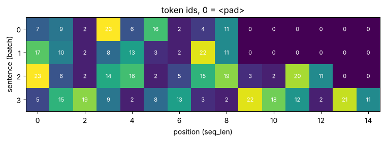

# 03-01 문자 단위 토크나이저 만들기

[](https://colab.research.google.com/github/alsrjs0725/EntryToPytorchForStudent/blob/main/notebooks/03-토크나이저/01-문자-단위-토크나이저-만들기.ipynb)

모델은 글자를 직접 읽지 못하고 숫자만 다뤄요. 토크나이저(tokenizer)는 문장을 토큰(token)으로 자르고, 토큰마다 번호를 붙여 정수 시퀀스로 바꿔요. 이 문서를 마치면 문자 단위 토크나이저를 직접 만들고, 길이가 다른 문장들을 한 배치로 묶어 임베딩 레이어에 넣을 수 있어요.

**사전 지식:** [02-03 임베딩 레이어](../02-레이어-실제-구조와-종류/03-임베딩-레이어.md)

완성하면 문장 4개가 이런 정수 표로 바뀌어요. 0은 빈자리를 채운 패딩이에요.



## 1. 문장을 문자로 쪼개기

가장 쉬운 방법은 한 글자를 토큰 하나로 보는 거예요. 파이썬 문자열은 `list()`만 해도 문자로 쪼개져요. 공백도 토큰 하나예요.

```python
corpus = [
    "나는 학교에 간다",
    "오늘 날씨가 좋다",
    "학교 앞에 고양이가 있다",
    "고양이는 날씨가 좋으면 잔다",
]
print(list(corpus[0]))
```

```
['나', '는', ' ', '학', '교', '에', ' ', '간', '다']
```

## 2. 어휘집 만들기

어휘집(vocabulary)은 토크나이저가 아는 토큰의 목록이에요. 말뭉치(corpus, 학습에 쓰는 글 모음)에 나온 문자를 모아 정렬하고, 앞에 특수 토큰 두 개를 붙여요.

- `<pad>`: 길이를 맞추려고 채우는 빈칸이에요. 0번으로 둬요.
- `<unk>`: 어휘집에 없는 문자(unknown)를 대신해요.

```python
chars = sorted(set("".join(corpus)))
itos = ["<pad>", "<unk>"] + chars             # 번호 -> 토큰
stoi = {t: i for i, t in enumerate(itos)}     # 토큰 -> 번호
print(len(itos))
```

```
24
```

`itos`(index to string)는 리스트, `stoi`(string to index)는 딕셔너리예요. 두 방향을 모두 준비해 둬요.

## 3. 인코딩과 디코딩

인코딩(encoding)은 문장을 번호 목록으로, 디코딩(decoding)은 번호 목록을 문장으로 바꾸는 일이에요.

```python
def encode(text):
    return [stoi.get(ch, stoi["<unk>"]) for ch in text]

def decode(ids):
    return "".join(itos[i] for i in ids if i != stoi["<pad>"])

print(encode("나는 학교에 간다"))
print(decode(encode("나는 학교에 간다")))
print(decode(encode("나는 집에 간다")))  # 어휘집에 없는 문자 '집'
```

```
[7, 9, 2, 23, 6, 16, 2, 4, 11]
나는 학교에 간다
나는 <unk>에 간다
```

어휘집에 없는 '집'은 `<unk>`가 되어 원래 글자를 잃어요. 그래서 어휘집은 충분히 큰 말뭉치로 만들어야 해요.

## 4. 클래스로 묶기

뒤 챕터에서 다시 쓰려고 클래스로 묶어요. 05 띄어쓰기 모델에서 이 클래스를 그대로 써요.

```python
class CharTokenizer:
    def __init__(self, texts, special=("<pad>", "<unk>")):
        chars = sorted(set("".join(texts)))
        self.itos = list(special) + chars
        self.stoi = {t: i for i, t in enumerate(self.itos)}
        self.pad_id = self.stoi["<pad>"]
        self.unk_id = self.stoi["<unk>"]

    def __len__(self):
        return len(self.itos)

    def encode(self, text):
        return [self.stoi.get(ch, self.unk_id) for ch in text]

    def decode(self, ids):
        return "".join(self.itos[i] for i in ids if i != self.pad_id)
```

## 5. 길이가 다른 문장을 한 배치로: 패딩

텐서는 직사각형이어야 해서, 길이가 다른 문장을 그대로 쌓을 수 없어요. 가장 긴 문장에 맞춰 짧은 문장 뒤를 `<pad>`(0)로 채워요. 이걸 패딩(padding)이라고 해요. 어디가 진짜 토큰인지 알려 주는 마스크(mask)도 함께 만들어요.

```python
def make_batch(texts, tok):
    encoded = [tok.encode(t) for t in texts]
    max_len = max(len(e) for e in encoded)
    ids = torch.full((len(texts), max_len), tok.pad_id)  # (batch, max_len)
    for i, e in enumerate(encoded):
        ids[i, : len(e)] = torch.tensor(e)
    mask = ids != tok.pad_id  # (batch, max_len), 진짜 토큰이면 True
    return ids, mask

ids, mask = make_batch(corpus, tok)
print(ids.shape)
print(mask.sum(dim=1))  # 문장마다 진짜 토큰 수
```

```
torch.Size([4, 15])
tensor([ 9,  9, 13, 15])
```

가장 긴 문장이 15글자라서 `(4, 15)`가 됐어요. 문서 맨 위 그림이 이 `ids`예요. 마스크는 04 트랜스포머에서 패딩 자리를 무시할 때 써요.

## 6. 임베딩 레이어에 넣기

정수 배치를 [02-03](../02-레이어-실제-구조와-종류/03-임베딩-레이어.md)의 임베딩 레이어에 넣으면 토큰마다 벡터가 돼요. `padding_idx`를 주면 `<pad>` 자리는 0 벡터로 고정되고 학습되지 않아요.

```python
emb = nn.Embedding(len(tok), 8, padding_idx=tok.pad_id)
x = emb(ids)              # (batch=4, seq_len=15, 8)
print(ids.shape, "->", x.shape)
print(x[1, -1])           # <pad> 자리
```

```
torch.Size([4, 15]) -> torch.Size([4, 15, 8])
tensor([0., 0., 0., 0., 0., 0., 0., 0.], grad_fn=<SelectBackward0>)
```

문장 → 정수 `(batch, seq_len)` → 벡터 `(batch, seq_len, d)`. 이제 문장이 레이어가 다룰 수 있는 모양이 됐어요.

## 정리

- 토크나이저는 문장을 토큰으로 자르고 어휘집 번호로 바꿔요(인코딩). 반대는 디코딩이에요.
- `<pad>`로 길이를 맞춰 배치를 만들고, 마스크로 진짜 토큰 자리를 표시해요.
- 정수 배치를 임베딩 레이어에 넣으면 `(batch, seq_len, d)` 모양의 벡터가 돼요.

**다음 문서:** [03-02 단어와 서브워드 토큰화](02-단어와-서브워드-토큰화.md)
