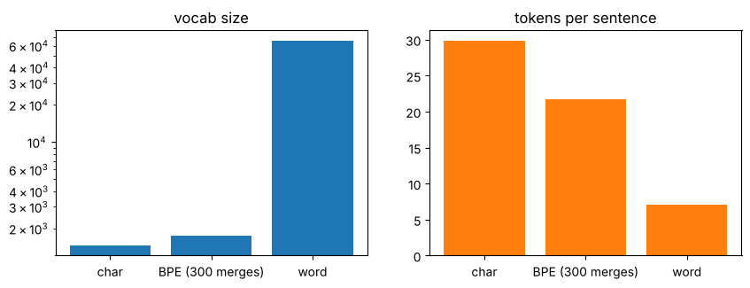

# 03-02 단어와 서브워드 토큰화

[](https://colab.research.google.com/github/alsrjs0725/EntryToPytorchForStudent/blob/main/notebooks/03-토크나이저/02-단어와-서브워드-토큰화.ipynb)

토큰을 얼마나 크게 자를지는 정하기 나름이에요. 문자 단위, 단어 단위, 그리고 그 중간인 서브워드(subword) 단위가 있어요. 이 문서를 마치면 세 방법의 장단점을 어휘집 크기와 문장 길이로 비교하고, 서브워드 방식인 BPE가 어떻게 동작하는지 설명할 수 있어요.

**사전 지식:** [03-01 문자 단위 토크나이저 만들기](01-문자-단위-토크나이저-만들기.md)

## 1. 말뭉치 준비

실제 한국어 문장으로 비교해요. [KLUE](https://github.com/KLUE-benchmark/KLUE) 벤치마크의 자연어 추론(NLI) 학습 데이터에서 문장 3만 3천여 개를 꺼내 써요(CC BY-SA 4.0). 뉴스, 위키백과, 영화 리뷰 등 여러 출처의 문장이 섞여 있어요. 05, 06 챕터에서도 이 말뭉치를 써요.

```python
URL = "https://raw.githubusercontent.com/KLUE-benchmark/KLUE/main/klue_benchmark/klue-nli-v1.1/klue-nli-v1.1_train.json"
urllib.request.urlretrieve(URL, "klue_nli_train.json")
...
train, test = sentences[:30000], sentences[30000:]
```

```
30000 3327
['이벤트 참여자는 선착순으로 매일 3010명까지 쿠폰을 받는다.', '우주 기술의 속도가 계속 빨라지고 있다.', '이런 것을 보고 명작이라고 하지 않을까.']
```

어휘집은 학습용 3만 문장으로 만들고, 나머지 3,327문장(테스트용)으로 처음 보는 문장을 얼마나 잘 다루는지 확인해요.

## 2. 단어 단위: 띄어쓰기로 자르기

가장 먼저 떠오르는 방법은 띄어쓰기로 자르는 거예요. 그런데 한국어는 단어 뒤에 조사와 어미가 붙어서, 같은 단어도 여러 모양으로 나와요.

```
학교 27
학교에 12
학교를 9
학교가 4
학교에서 17
학교로 2
```

모두 다른 토큰이 되니 어휘집이 커져요. 3만 문장에서 서로 다른 단어가 65,803개나 나와요. 게다가 처음 보는 문장의 단어 중 17.7%는 어휘집에 없어서 `<unk>`가 돼요.

## 3. 문자 단위

문자 단위로 자르면 어휘집이 1,457개로 작고, 테스트 문장의 문자 중 어휘집에 없는 비율도 0.02%뿐이에요. 대신 문장이 길어져요. 토큰 하나가 담는 의미가 작아서, 모델이 글자를 조합해 뜻을 알아내는 일까지 해야 해요.

## 4. 서브워드: BPE를 직접 만들기

서브워드는 자주 나오는 글자 조합을 토큰 하나로 묶는 방법이에요. 가장 널리 쓰는 방법이 BPE(Byte Pair Encoding)예요. 아이디어는 단순해요.

1. 모든 단어를 문자로 쪼개서 시작해요.
2. 말뭉치에서 가장 자주 붙어 나오는 토큰 쌍을 찾아 하나로 합쳐요.
3. 2를 원하는 횟수만큼 반복해요.

단어 앞에는 `▁`를 붙여 "여기서 띄어 썼다"는 정보를 남겨요. 그래야 디코딩할 때 띄어쓰기를 되살릴 수 있어요.

```python
bpe_vocab = {("▁",) + tuple(w): c for w, c in word_counts.items()}
merges = []
for step in range(300):
    pairs = get_pair_counts(bpe_vocab)     # 붙어 나온 쌍마다 횟수 세기
    best = max(pairs, key=pairs.get)       # 가장 자주 나온 쌍
    bpe_vocab = merge_pair(bpe_vocab, best)
    merges.append(best)
```

```
처음 합친 쌍 10개: ['다.', '니다.', '▁이', '▁있', '▁사', '에서', '습니다.', '이다.', '▁영', '▁대']
마지막 합친 쌍 10개: ['▁창', '▁여행', '▁충', '▁앞', '영화', '▁하나', '▁진행', '▁달', '▁별', '▁내용']
```

처음에는 "다.", "습니다.", "에서"처럼 문장 끝과 조사가 먼저 합쳐져요. 가장 자주 나오기 때문이에요. 뒤로 갈수록 "여행", "진행" 같은 단어가 합쳐져요.

새 문장은 배운 순서대로 합치기를 적용해서 토큰으로 나눠요.

```
학교에서 친구를 만났다
  ['▁학', '교', '에서', '▁친', '구', '를', '▁만', '났', '다']
```

"에서"는 하나의 토큰이 됐고, 300번만 합쳐서 "학교"는 아직 두 토큰이에요. 합치는 횟수를 늘리면 "학교" 같은 단어도 토큰 하나가 돼요. 어떤 문장이든 최악의 경우 문자로 쪼개지니, 어휘집에 없어서 정보를 잃는 일이 거의 없어요.

## 5. 세 방법 비교하기

테스트 문장 500개로 비교해요.

```
char               어휘집   1457개, 문장당 평균 토큰 29.8개
BPE (300 merges)   어휘집   1758개, 문장당 평균 토큰 21.8개
word               어휘집  65803개, 문장당 평균 토큰 7.0개
```



| 방법 | 어휘집 | 문장 길이 | 처음 보는 단어 |
| --- | --- | --- | --- |
| 문자 | 작아요 | 길어요 | 거의 없어요 |
| 단어 | 매우 커요 | 짧아요 | 많아요(17.7%) |
| BPE | 중간, 합치는 횟수로 조절 | 중간 | 거의 없어요 |

어휘집이 크면 임베딩 레이어와 출력 레이어가 커지고, 문장이 길면 어텐션 계산이 늘어요. BPE는 둘 사이에서 균형을 잡을 수 있어서 GPT 같은 실제 LLM은 대부분 BPE 계열 토크나이저를 써요.

!!! note "이 튜토리얼의 선택"
    05 띄어쓰기 모델은 "글자마다 뒤에 띄어 쓸지"를 맞히는 문제라 문자 단위가 자연스러워요. 06 기초 LLM도 코드를 단순하게 하려고 문자 단위를 써요. 06을 마친 뒤 토크나이저를 BPE로 바꿔 보는 것도 좋은 연습이에요.

## 정리

- 단어 단위는 어휘집이 너무 크고 처음 보는 단어에 약해요. 한국어는 조사와 어미 때문에 특히 그래요.
- 문자 단위는 어휘집이 작고 빠지는 글자가 거의 없지만 문장이 길어져요.
- BPE는 자주 붙어 나오는 쌍을 반복해서 합쳐, 어휘집 크기와 문장 길이 사이의 균형을 잡아요.

**다음 문서:** [04-01 어텐션은 왜 필요한가](../04-트랜스포머/01-어텐션은-왜-필요한가.md)
