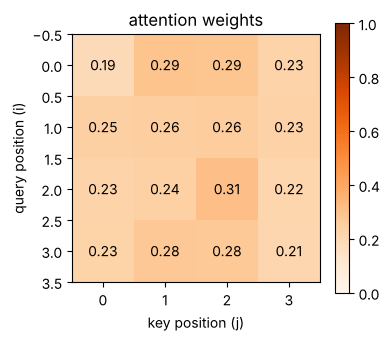
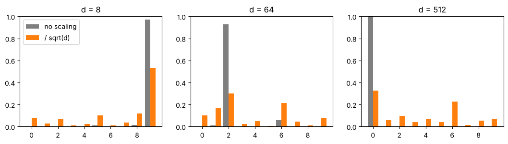

# 04-01 어텐션은 왜 필요한가

[](https://colab.research.google.com/github/alsrjs0725/EntryToPytorchForStudent/blob/main/notebooks/04-트랜스포머/01-어텐션은-왜-필요한가.ipynb)

같은 글자나 단어도 문맥에 따라 뜻이 달라요. 임베딩만으로는 이 차이를 알 수 없어요. 어텐션(attention)은 각 토큰이 문장의 다른 토큰을 보고 정보를 섞어 오게 해요. 이 문서를 마치면 어텐션이 쿼리, 키, 값으로 가중 평균을 만드는 과정을 코드와 그림으로 설명할 수 있어요.

**사전 지식:** [02-02 소프트맥스](../02-레이어-실제-구조와-종류/02-활성화-함수와-소프트맥스.md), [02-03 임베딩 레이어](../02-레이어-실제-구조와-종류/03-임베딩-레이어.md), [03-01 토크나이저](../03-토크나이저/01-문자-단위-토크나이저-만들기.md)

<video src="../../videos/04-트랜스포머/attention_mix.mp4" controls autoplay loop muted playsinline width="600"></video>

## 1. 문제: 임베딩만으로는 문맥을 몰라요

"배가 고프다"의 배와 "바다에 배가 떠 있다"의 배는 뜻이 달라요. 그런데 임베딩 레이어는 같은 토큰에 항상 같은 벡터를 줘요.

```python
s1 = ["배", "가", "고프다"]
s2 = ["바다", "에", "배", "가", "떠", "있다"]
v1 = emb(torch.tensor([stoi[t] for t in s1]))  # (3, 4)
v2 = emb(torch.tensor([stoi[t] for t in s2]))  # (6, 4)
print(torch.equal(v1[0], v2[2]))  # 두 문장의 "배"
```

```
True
```

뜻을 구분하려면 "배"의 벡터에 주변 토큰("고프다" 또는 "바다") 정보가 섞여 들어가야 해요.

!!! note "어텐션 전에는"
    예전에는 RNN(순환 신경망)이 토큰을 왼쪽부터 하나씩 읽으며 앞 내용을 기억해 넘겼어요. 순서대로 처리해야 해서 느리고, 멀리 떨어진 토큰의 정보는 넘기는 동안 흐려졌어요. 어텐션은 모든 토큰이 다른 모든 토큰을 **한 번에, 직접** 봐요.

## 2. 아이디어: 다른 토큰을 섞은 가중 평균

토큰마다 "다른 토큰을 얼마나 볼지" 가중치를 정하고, 가중 평균을 내요. 가중치의 합은 1이에요. 위 영상에서 "배"는 "바다"를 0.45만큼 가장 많이 보고 새 벡터를 만들어요(영상의 가중치는 설명용 예시예요).

```python
x = torch.randn(4, 8)                               # (seq_len=4, d=8), 토큰 4개
weights = torch.tensor([0.1, 0.6, 0.1, 0.2])        # 합이 1인 가중치
mixed = (weights.unsqueeze(1) * x).sum(dim=0)       # (8,)
print(torch.allclose(mixed, weights @ x))           # 행렬 곱과 같아요
```

```
True
```

가중 평균은 행렬 곱 한 번이에요. 남은 질문은 "가중치를 어떻게 정할까"예요.

## 3. 가중치 정하기: 쿼리, 키, 값

각 토큰 벡터를 선형 레이어 세 개에 통과시켜 역할이 다른 벡터 세 개를 만들어요.

- **쿼리(query, Q):** 내가 찾는 정보예요. "나는 어떤 토큰이 필요하지?"
- **키(key, K):** 내가 가진 특징이에요. "나는 이런 토큰이야."
- **값(value, V):** 나를 보는 토큰에 전해 줄 내용이에요.

토큰 i의 쿼리와 토큰 j의 키를 내적(같은 위치끼리 곱해서 더하기)하면, 둘이 얼마나 잘 맞는지 점수가 나와요. 점수에 소프트맥스를 하면 합이 1인 가중치가 되고, 이 가중치로 값을 가중 평균해요.

$$
\text{Attention}(Q, K, V) = \text{softmax}\left(\frac{QK^T}{\sqrt{d}}\right)V
$$

```python
Q = q_proj(x)  # (4, 8)
K = k_proj(x)  # (4, 8)
V = v_proj(x)  # (4, 8)

scores = Q @ K.T / math.sqrt(d)    # (4, 4), 토큰 i가 토큰 j를 얼마나 볼지
attn = F.softmax(scores, dim=-1)   # (4, 4), 행마다 합이 1
out = attn @ V                     # (4, 8)
```

어텐션 가중치 `attn`은 `(토큰 수, 토큰 수)` 표예요. i번째 행은 토큰 i가 각 토큰을 얼마나 보는지예요.

{ width="380" }

아직 학습하지 않은 무작위 가중치라서 모든 토큰을 0.2~0.3 정도로 고르게 봐요. 학습하면 필요한 토큰에 가중치가 몰려요. [04-04](04-트랜스포머-블록-만들기.md)에서 학습한 모델의 어텐션을 확인해요.

입출력 모양은 `(seq_len, d)` → `(seq_len, d)`로 같아요. 토큰 수는 그대로이고, 토큰마다 다른 토큰의 정보가 섞인 벡터로 바뀌어요.

## 4. 함수로 묶고 PyTorch와 비교하기

배치 축이 앞에 있어도 동작하도록 `K.transpose(-2, -1)`로 마지막 두 축만 바꿔요.

```python
def attention(Q, K, V):
    # Q, K, V: (..., seq_len, d)
    d = Q.shape[-1]
    scores = Q @ K.transpose(-2, -1) / math.sqrt(d)  # (..., seq_len, seq_len)
    weights = F.softmax(scores, dim=-1)
    return weights @ V, weights                      # (..., seq_len, d)

out_mine, _ = attention(Q, K, V)
out_torch = F.scaled_dot_product_attention(Q, K, V)
print(torch.allclose(out_mine, out_torch, atol=1e-6))
```

```
True
```

PyTorch의 `F.scaled_dot_product_attention`과 결과가 같아요. 이 함수는 GPU에서 더 빠르게 계산해요.

## 5. 왜 √d로 나눌까

벡터 길이 `d`가 커지면 내적 값이 커져요. 무작위 벡터로 재 보면 내적의 표준편차가 대략 `√d`예요.

```
d=  8: 내적의 표준편차 2.8, sqrt(d)로 나누면 0.99
d= 64: 내적의 표준편차 8.0, sqrt(d)로 나누면 1.00
d=512: 내적의 표준편차 22.6, sqrt(d)로 나누면 1.00
```

점수가 크면 소프트맥스가 가장 큰 하나에 거의 1을 몰아줘요. 그러면 나머지 토큰의 기울기가 0에 가까워져 학습이 잘 안 돼요. `√d`로 나누면 `d`와 상관없이 점수 크기가 1 정도로 유지돼요.



## 정리

- 임베딩은 문맥을 모르니, 어텐션으로 다른 토큰의 정보를 가중 평균해 섞어요.
- 가중치는 쿼리와 키의 내적을 `√d`로 나누고 소프트맥스해서 구하고, 그 가중치로 값을 섞어요.
- 입출력 모양은 `(seq_len, d)`로 같아요.

**다음 문서:** [04-02 멀티헤드 어텐션](02-멀티헤드-어텐션.md)
