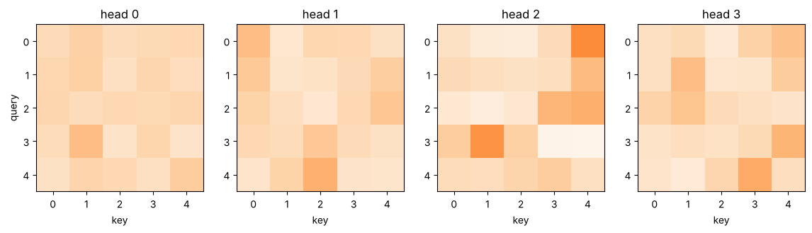

# 04-02 멀티헤드 어텐션

[](https://colab.research.google.com/github/alsrjs0725/EntryToPytorchForStudent/blob/main/notebooks/04-트랜스포머/02-멀티헤드-어텐션.ipynb)

어텐션 하나는 토큰마다 가중치 한 벌만 정해요. 그런데 한 토큰은 여러 관계를 동시에 봐야 해요. 예를 들어 "배"는 뜻을 정하려고 "바다"를 보고, 문법을 보려고 바로 뒤 조사 "가"도 봐야 해요. 멀티헤드 어텐션(multi-head attention)은 어텐션 여러 개(헤드)를 나란히 계산해요. 이 문서를 마치면 멀티헤드 어텐션을 직접 구현하고, 각 단계의 텐서 모양을 설명할 수 있어요.

**사전 지식:** [04-01 어텐션은 왜 필요한가](01-어텐션은-왜-필요한가.md), [00-02의 transpose](../00-시작하기/02-텐서-기초.md)

## 1. 헤드 나누기: 모양 바꾸기만으로

헤드를 따로 만들 필요는 없어요. 벡터 길이 `d_model`을 헤드 수 `H`로 나눠서, 조각마다 따로 어텐션을 계산하면 돼요. `d_model=16`, `H=4`이면 헤드 하나가 길이 4짜리 조각(`d_head`)을 맡아요.

```python
B, T, d_model, n_heads = 2, 5, 16, 4
d_head = d_model // n_heads                  # 4

x = torch.randn(B, T, d_model)               # (2, 5, 16)
h = x.view(B, T, n_heads, d_head)            # (2, 5, 4, 4)
h = h.transpose(1, 2)                        # (2, 4, 5, 4) = (batch, head, seq_len, d_head)

back = h.transpose(1, 2).reshape(B, T, d_model)  # (2, 5, 16)
print(torch.equal(back, x))
```

```
True
```

헤드 축을 배치 축 바로 뒤로 옮기면 `(batch, head)`가 앞쪽 축이 돼요. [04-01의 `attention` 함수](01-어텐션은-왜-필요한가.md)는 앞쪽 축을 모두 배치처럼 다루니, 모든 헤드를 한 번에 계산할 수 있어요. 다시 원래 모양으로 되돌리면 헤드 결과를 이어 붙인 셈이에요.

## 2. 멀티헤드 어텐션 직접 구현

| 단계 | 하는 일 | 모양 |
| --- | --- | --- |
| 입력 | | `(B, T, d_model)` |
| `q_proj`, `k_proj`, `v_proj` | 선형 레이어로 Q, K, V 만들기 | `(B, T, d_model)` |
| `split` | 헤드로 나누기 | `(B, H, T, d_head)` |
| 어텐션 점수 | `q @ k.T / √d_head` | `(B, H, T, T)` |
| 가중 평균 | `softmax(점수) @ v` | `(B, H, T, d_head)` |
| 이어 붙이기 | 헤드 합치기 | `(B, T, d_model)` |
| `out_proj` | 선형 레이어로 헤드 결과 섞기 | `(B, T, d_model)` |

```python
class MultiHeadAttention(nn.Module):
    def __init__(self, d_model, n_heads):
        super().__init__()
        assert d_model % n_heads == 0
        self.n_heads = n_heads
        self.d_head = d_model // n_heads
        self.q_proj = nn.Linear(d_model, d_model)
        self.k_proj = nn.Linear(d_model, d_model)
        self.v_proj = nn.Linear(d_model, d_model)
        self.out_proj = nn.Linear(d_model, d_model)

    def split(self, t):
        B, T, _ = t.shape
        return t.view(B, T, self.n_heads, self.d_head).transpose(1, 2)  # (B, H, T, d_head)

    def forward(self, x, mask=None):
        B, T, d_model = x.shape
        q = self.split(self.q_proj(x))  # (B, H, T, d_head)
        k = self.split(self.k_proj(x))
        v = self.split(self.v_proj(x))
        scores = q @ k.transpose(-2, -1) / math.sqrt(self.d_head)  # (B, H, T, T)
        if mask is not None:
            scores = scores.masked_fill(~mask, float("-inf"))
        self.weights = F.softmax(scores, dim=-1)                   # (B, H, T, T)
        out = self.weights @ v                                     # (B, H, T, d_head)
        out = out.transpose(1, 2).reshape(B, T, d_model)           # (B, T, d_model)
        return self.out_proj(out)
```

```
torch.Size([2, 5, 16]) -> torch.Size([2, 5, 16])
torch.Size([2, 4, 5, 5])
```

입출력 모양이 `(B, T, d_model)`로 같아요. 어텐션 가중치는 헤드마다 하나씩 `(B, H, T, T)`예요. 헤드마다 Q, K가 다르니 가중치 패턴도 달라요.



파라미터는 선형 레이어 4개, 1,088개예요. 헤드 수를 바꿔도 파라미터 수는 같아요.

## 3. 패딩 마스크

[03-01](../03-토크나이저/01-문자-단위-토크나이저-만들기.md)에서 짧은 문장 뒤를 `<pad>`로 채웠어요. 패딩 자리는 진짜 토큰이 아니니 어텐션이 보면 안 돼요. 점수를 소프트맥스하기 전에 패딩 자리 점수를 `-inf`로 바꾸면, `e^-inf = 0`이라서 가중치가 0이 돼요.

```python
lengths = torch.tensor([5, 3])                                    # 두 번째 문장은 진짜 토큰이 3개
pad_mask = torch.arange(T).unsqueeze(0) < lengths.unsqueeze(1)    # (B, T)
mask = pad_mask[:, None, None, :]                                 # (B, 1, 1, T)
y = mha(x, mask)
print(mha.weights[1, 0])  # 두 번째 문장, 0번 헤드
```

```
tensor([[0.3758, 0.3417, 0.2825, 0.0000, 0.0000],
        [0.3057, 0.3357, 0.3586, 0.0000, 0.0000],
        [0.3738, 0.2753, 0.3509, 0.0000, 0.0000],
        [0.3345, 0.3463, 0.3191, 0.0000, 0.0000],
        [0.3426, 0.3603, 0.2971, 0.0000, 0.0000]], grad_fn=<SelectBackward0>)
```

마스크 모양 `(B, 1, 1, T)`는 브로드캐스팅으로 모든 헤드와 모든 쿼리 행에 같은 마스크를 적용해요. 마지막 두 열(패딩)의 가중치가 0이 됐어요.

## 4. nn.MultiheadAttention과 비교하기

PyTorch의 `nn.MultiheadAttention`에 같은 가중치를 넣으면 결과가 같아요. 두 가지만 달라요.

- Q, K, V 가중치를 `in_proj_weight` 하나로 이어 붙여 저장해요.
- 마스크의 `True`가 "가린다"는 뜻이에요. 그래서 `~pad_mask`를 넘겨요.

```python
y_torch, _ = torch_mha(x, x, x, key_padding_mask=~pad_mask)
print(torch.allclose(y, y_torch, atol=1e-5))
```

```
True
```

## 정리

- 멀티헤드 어텐션은 `d_model`을 헤드 수로 나눠 여러 어텐션을 나란히 계산하고, 결과를 이어 붙여 선형 레이어로 섞어요.
- 헤드 나누기는 `view`와 `transpose`만으로 해요. 모양은 `(B, T, d_model)` → `(B, H, T, d_head)` → `(B, T, d_model)`이에요.
- 패딩 마스크로 패딩 자리 점수를 `-inf`로 만들어 가중치를 0으로 해요.

**다음 문서:** [04-03 위치 정보](03-위치-정보.md)
