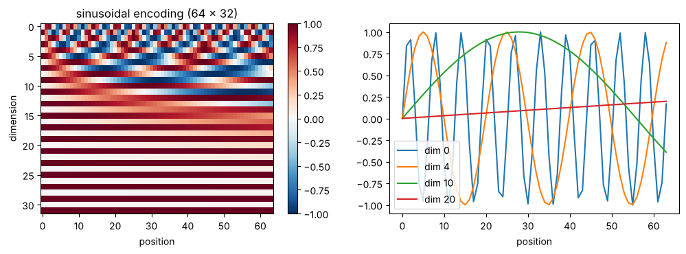
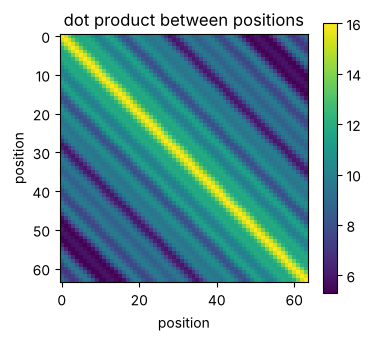

# 04-03 위치 정보

[](https://colab.research.google.com/github/alsrjs0725/EntryToPytorchForStudent/blob/main/notebooks/04-트랜스포머/03-위치-정보.ipynb)

"개가 사람을 물었다"와 "사람이 개를 물었다"는 순서만 바꿔도 뜻이 달라요. 그런데 어텐션은 토큰의 순서를 전혀 몰라요. 이 문서를 마치면 어텐션이 순서를 모르는 이유를 코드로 확인하고, 위치 임베딩으로 순서 정보를 더할 수 있어요.

**사전 지식:** [04-02 멀티헤드 어텐션](02-멀티헤드-어텐션.md), [02-03 임베딩 레이어](../02-레이어-실제-구조와-종류/03-임베딩-레이어.md)

## 1. 문제: 어텐션은 순서를 몰라요

어텐션의 계산을 다시 보면, 토큰끼리 쿼리와 키를 내적하고 값을 가중 평균해요. 어디에도 "몇 번째 토큰인가"가 들어가지 않아요. 그래서 입력 순서를 섞으면, 출력도 똑같이 섞일 뿐 값은 그대로예요.

```python
mha = nn.MultiheadAttention(embed_dim=8, num_heads=2, batch_first=True)
x = torch.randn(1, 5, 8)                 # (batch=1, seq_len=5, d=8)
perm = torch.tensor([4, 2, 0, 1, 3])     # 토큰 순서를 섞어요
x_shuffled = x[:, perm]

y, _ = mha(x, x, x)
y_shuffled, _ = mha(x_shuffled, x_shuffled, x_shuffled)
print(torch.allclose(y[:, perm], y_shuffled, atol=1e-6))
```

```
True
```

섞은 입력의 출력이 원래 출력을 똑같이 섞은 것과 같아요. 모델 입장에서 문장은 순서 없는 토큰 주머니예요.

## 2. 방법 1: 학습하는 위치 임베딩

해결 방법은 간단해요. 토큰 임베딩에 "위치마다 다른 벡터"를 더해요. 위치 0, 1, 2, …도 번호니까 [02-03의 임베딩 레이어](../02-레이어-실제-구조와-종류/03-임베딩-레이어.md)로 벡터를 만들 수 있어요.

```python
max_len, d_model = 16, 8
tok_emb = nn.Embedding(10, d_model)
pos_emb = nn.Embedding(max_len, d_model)   # 위치 0~15마다 벡터 하나

ids = torch.tensor([[3, 1, 4, 1, 5]])                   # (1, 5)
positions = torch.arange(ids.shape[1])                  # (5,) = [0, 1, 2, 3, 4]
h = tok_emb(ids) + pos_emb(positions)                   # (1, 5, 8) + (5, 8) -> (1, 5, 8)
print(torch.equal(tok_emb(ids)[0, 1], tok_emb(ids)[0, 3]))  # 같은 토큰 1
print(torch.equal(h[0, 1], h[0, 3]))                         # 위치를 더하면?
```

```
True
False
```

1번 자리와 3번 자리의 토큰은 둘 다 `1`이에요. 토큰 임베딩은 같지만 위치를 더하니 달라졌어요. 이제 순서를 섞은 문장에 위치를 다시 더해 어텐션에 넣으면 1절의 비교가 `False`가 돼요. 순서가 결과에 영향을 줘요.

모양은 바뀌지 않아요. `(batch, seq_len, d_model)`에 `(seq_len, d_model)`을 브로드캐스팅으로 더해요. 이 방법은 GPT 계열 모델이 쓰고, 이 튜토리얼의 05, 06 챕터도 이 방법을 써요. 단점은 `max_len`보다 긴 문장을 다룰 수 없다는 거예요.

## 3. 방법 2: 사인 코사인 위치 인코딩

처음 트랜스포머 논문은 학습하지 않는 고정된 값을 썼어요. 차원마다 주기가 다른 사인, 코사인 파형으로 위치를 표현해요.

$$
PE_{(pos, 2i)} = \sin\left(\frac{pos}{10000^{2i/d}}\right), \quad PE_{(pos, 2i+1)} = \cos\left(\frac{pos}{10000^{2i/d}}\right)
$$

```python
def sinusoidal_encoding(max_len, d_model):
    pos = torch.arange(max_len).unsqueeze(1)          # (max_len, 1)
    i = torch.arange(0, d_model, 2)                   # (d_model / 2,)
    freq = 1.0 / (10000 ** (i / d_model))             # 차원마다 다른 주기
    pe = torch.zeros(max_len, d_model)                # (max_len, d_model)
    pe[:, 0::2] = torch.sin(pos * freq)
    pe[:, 1::2] = torch.cos(pos * freq)
    return pe
```



앞쪽 차원은 빠르게, 뒤쪽 차원은 느리게 진동해요. 시계의 초침, 분침, 시침처럼 여러 주기를 함께 보면 위치마다 다른 무늬가 돼요.

위치끼리 내적하면 가까운 위치일수록 값이 커요. 위치 벡터가 "얼마나 떨어져 있는지"도 담고 있다는 뜻이에요.

{ width="380" }

| 방법 | 파라미터 | 긴 문장 | 쓰는 곳 |
| --- | --- | --- | --- |
| 학습하는 위치 임베딩 | `max_len × d_model`개 | `max_len`까지만 | GPT-2, 이 튜토리얼 |
| 사인 코사인 | 없음 | 계산은 가능 | 원조 트랜스포머 |

## 정리

- 어텐션은 순서를 몰라서, 입력을 섞으면 출력도 똑같이 섞일 뿐이에요.
- 토큰 임베딩에 위치 벡터를 더해 순서 정보를 넣어요. 모양은 그대로예요.
- 위치 벡터는 임베딩으로 학습하거나 사인 코사인으로 계산해요.

**다음 문서:** [04-04 트랜스포머 블록 만들기](04-트랜스포머-블록-만들기.md)
