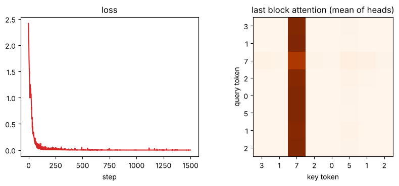

# 04-04 트랜스포머 블록 만들기

[](https://colab.research.google.com/github/alsrjs0725/EntryToPytorchForStudent/blob/main/notebooks/04-트랜스포머/04-트랜스포머-블록-만들기.ipynb)

트랜스포머 블록은 지금까지 만든 레이어를 정해진 순서로 쌓은 거예요. 새 레이어는 없어요. 이 문서를 마치면 트랜스포머 블록과 인코더를 레이어 조합으로 직접 구현하고, 작은 문제로 학습시켜 어텐션이 정보를 모으는 모습을 확인할 수 있어요.

**사전 지식:** [04-02 멀티헤드 어텐션](02-멀티헤드-어텐션.md), [04-03 위치 정보](03-위치-정보.md), [02-04 정규화와 드롭아웃](../02-레이어-실제-구조와-종류/04-정규화와-드롭아웃.md), [02-05의 잔차 연결](../02-레이어-실제-구조와-종류/05-레이어를-쌓아-모델-만들기.md)

## 1. 블록의 구조

트랜스포머 블록은 두 부분으로 나뉘어요.

```
입력 x (B, T, d_model)
 ├─ LayerNorm → 멀티헤드 어텐션 → 드롭아웃 ─┐
 x + ←──────────────────────────────────────┘   토큰끼리 정보 섞기
 ├─ LayerNorm → 선형 → GELU → 선형 → 드롭아웃 ─┐
 x + ←─────────────────────────────────────────┘ 토큰마다 따로 계산하기
출력 (B, T, d_model)
```

- **어텐션 부분:** 토큰끼리 정보를 주고받아요.
- **피드포워드(feed-forward) 부분:** 토큰마다 따로, 모은 정보를 가공해요. 선형 레이어 두 개 사이에 활성화 함수가 있는 [02-05의 MLP](../02-레이어-실제-구조와-종류/05-레이어를-쌓아-모델-만들기.md)와 같아요.
- 두 부분 모두 앞에 LayerNorm을 두고, 결과를 입력에 더해요(잔차 연결). LayerNorm을 앞에 두는 방식을 pre-LN이라고 하고, 요즘 모델 대부분이 이 방식을 써요.

입출력 모양이 같아서 블록을 몇 개든 이어 쌓을 수 있어요.

## 2. 피드포워드 레이어

중간 크기 `d_ff`는 보통 `d_model`의 4배로 정해요.

```python
class FeedForward(nn.Module):
    def __init__(self, d_model, d_ff, dropout=0.1):
        super().__init__()
        self.net = nn.Sequential(
            nn.Linear(d_model, d_ff),   # (B, T, d_model) -> (B, T, d_ff)
            nn.GELU(),
            nn.Linear(d_ff, d_model),   # (B, T, d_ff) -> (B, T, d_model)
            nn.Dropout(dropout),
        )

    def forward(self, x):
        return self.net(x)
```

선형 레이어는 마지막 축만 바꾸니까, `T`개 토큰에 같은 레이어가 따로따로 적용돼요.

## 3. 트랜스포머 블록

[04-02의 `MultiHeadAttention`](02-멀티헤드-어텐션.md)을 그대로 가져와 조립해요.

```python
class TransformerBlock(nn.Module):
    def __init__(self, d_model, n_heads, d_ff, dropout=0.1):
        super().__init__()
        self.norm1 = nn.LayerNorm(d_model)
        self.attn = MultiHeadAttention(d_model, n_heads)
        self.norm2 = nn.LayerNorm(d_model)
        self.ff = FeedForward(d_model, d_ff, dropout)
        self.dropout = nn.Dropout(dropout)

    def forward(self, x, mask=None):
        # x: (B, T, d_model)
        x = x + self.dropout(self.attn(self.norm1(x), mask))  # 토큰끼리 정보 섞기
        x = x + self.ff(self.norm2(x))                         # 토큰마다 따로 계산하기
        return x                                               # (B, T, d_model)
```

`d_model=32`, 헤드 4개, `d_ff=128`인 블록의 레이어별 파라미터 수예요.

```
norm1    파라미터    64개
attn     파라미터  4224개
norm2    파라미터    64개
ff       파라미터  8352개
dropout  파라미터     0개
```

피드포워드가 어텐션보다 파라미터가 2배 많아요.

### PyTorch와 비교하기

같은 설정의 `nn.TransformerEncoderLayer`(`norm_first=True`가 pre-LN)와 파라미터 수가 같아요. 구조가 같다는 뜻이에요.

```python
torch_block = nn.TransformerEncoderLayer(
    d_model=32, nhead=4, dim_feedforward=128, activation="gelu", norm_first=True, batch_first=True
)
```

```
직접 만든 블록: 12704
PyTorch 블록:   12704
```

## 4. 인코더: 임베딩 + 위치 + 블록 N개

토큰 번호를 받아 블록을 거친 벡터를 내는 전체 모델을 인코더(encoder)라고 해요.

| 단계 | 레이어 | 모양 |
| --- | --- | --- |
| 입력 | 토큰 번호 | `(B, T)` |
| 1 | 토큰 임베딩 + 위치 임베딩 | `(B, T, d_model)` |
| 2 | 트랜스포머 블록 × N | `(B, T, d_model)` |
| 3 | 마지막 LayerNorm | `(B, T, d_model)` |

```python
class Encoder(nn.Module):
    def __init__(self, vocab_size, d_model=64, n_heads=4, n_layers=2, d_ff=256, max_len=128, dropout=0.1):
        super().__init__()
        self.tok_emb = nn.Embedding(vocab_size, d_model)
        self.pos_emb = nn.Embedding(max_len, d_model)
        self.blocks = nn.ModuleList([TransformerBlock(d_model, n_heads, d_ff, dropout) for _ in range(n_layers)])
        self.norm = nn.LayerNorm(d_model)

    def forward(self, ids, mask=None):
        T = ids.shape[1]
        x = self.tok_emb(ids) + self.pos_emb(torch.arange(T, device=ids.device))  # (B, T, d_model)
        for block in self.blocks:
            x = block(x, mask)
        return self.norm(x)
```

인코더 뒤에 선형 레이어를 하나 붙이면 토큰마다 분류하는 모델이 돼요. 05 띄어쓰기 모델이 바로 이 구조예요.

## 5. 작은 문제로 확인하기: 가장 큰 숫자 찾기

블록이 제대로 동작하는지 작은 문제로 확인해요. 0~9 숫자 8개를 받아, **모든 위치에서** 문장 전체의 최댓값을 맞혀야 해요. 자기 숫자만 봐서는 풀 수 없고, 다른 토큰을 모두 봐야 풀려요. 어텐션이 필요한 문제예요.

```python
class MaxTagger(nn.Module):
    def __init__(self):
        super().__init__()
        self.encoder = Encoder(vocab_size=10, d_model=64, n_heads=4, n_layers=2, d_ff=128, max_len=16, dropout=0.0)
        self.head = nn.Linear(64, 10)

    def forward(self, ids):
        return self.head(self.encoder(ids))  # (B, T, 10)
```

토큰마다 10개 클래스 중 하나를 고르니, 손실은 `(B*T, 10)`과 `(B*T,)`로 펴서 교차 엔트로피를 계산해요.

```python
logits = model(ids)  # (B, T, 10)
loss = F.cross_entropy(logits.reshape(-1, 10), target.reshape(-1))
```

```
step    0: loss=2.4176
step  300: loss=0.0069
step  600: loss=0.0012
step  900: loss=0.0005
step 1200: loss=0.0002
정확도: 1.000
```

처음 보는 문장 1000개에서 모두 맞혔어요. 학습한 모델의 마지막 블록 어텐션을 그려 보면 이유가 보여요.

```
입력: [3, 1, 7, 2, 0, 5, 1, 2]
예측: [7, 7, 7, 7, 7, 7, 7, 7]
```



모든 쿼리 토큰이 최댓값 7이 있는 자리에 가중치를 몰아줬어요. 04-01의 무작위 어텐션은 고르게 퍼져 있었는데, 학습하면서 "필요한 토큰을 보는 법"을 배웠어요.

## 정리

- 트랜스포머 블록은 "LayerNorm → 어텐션 → 잔차"와 "LayerNorm → 피드포워드 → 잔차"를 이은 거예요.
- 입출력 모양이 `(B, T, d_model)`로 같아서 블록을 몇 개든 쌓을 수 있어요.
- 인코더는 토큰 임베딩, 위치 임베딩, 블록 N개, LayerNorm으로 이뤄져요.

**다음 문서:** [05-01 데이터 준비와 라벨 만들기](../05-띄어쓰기-모델/01-데이터-준비와-라벨-만들기.md)
