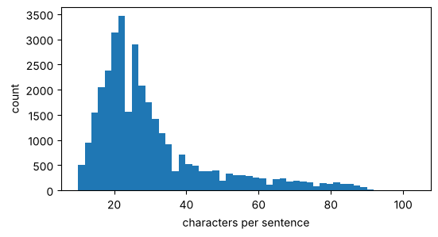
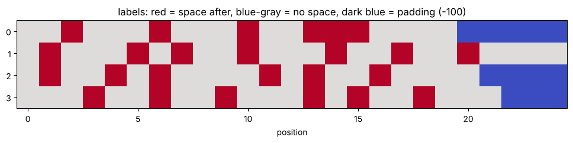

# 05-01 데이터 준비와 라벨 만들기

[](https://colab.research.google.com/github/alsrjs0725/EntryToPytorchForStudent/blob/main/notebooks/05-띄어쓰기-모델/01-데이터-준비와-라벨-만들기.ipynb)

이번 챕터에서는 붙여 쓴 문장을 받아 띄어쓰기를 되살리는 모델을 만들어요. "나는학교에간다"를 넣으면 "나는 학교에 간다"가 나와야 해요. 모델을 만들기 전에 문제를 모델이 풀 수 있는 모양으로 바꿔야 해요. 이 문서를 마치면 문장을 "글자 입력 + 글자별 라벨"로 바꾸고, 학습용 DataLoader를 만들 수 있어요.

**사전 지식:** [03-01 문자 단위 토크나이저 만들기](../03-토크나이저/01-문자-단위-토크나이저-만들기.md), [03-02의 KLUE 말뭉치](../03-토크나이저/02-단어와-서브워드-토큰화.md)

## 1. 문제를 시퀀스 라벨링으로 바꾸기

띄어쓰기 복원은 "글자마다 **뒤에 공백이 오는지** 맞히기"로 바꿀 수 있어요. 글자 하나하나에 0 또는 1 라벨을 붙이는 거예요. 이렇게 시퀀스의 토큰마다 라벨을 맞히는 문제를 시퀀스 라벨링(sequence labeling)이라고 해요.

| 글자 | 나 | 는 | 학 | 교 | 에 | 간 | 다 |
| --- | --- | --- | --- | --- | --- | --- | --- |
| 라벨 | 0 | **1** | 0 | 0 | **1** | 0 | 0 |

결국 토큰마다 클래스 2개 중 하나를 고르는 분류예요. [04-04의 최댓값 문제](../04-트랜스포머/04-트랜스포머-블록-만들기.md)와 같은 구조로 풀 수 있어요.

## 2. 문장 모으기

[03-02](../03-토크나이저/02-단어와-서브워드-토큰화.md)에서 쓴 KLUE NLI 말뭉치를 써요. 띄어쓰기가 된 문장이라면 무엇이든 학습 데이터가 돼요. 공백만 지우면 입력이 되고, 원래 문장이 정답이 되니까요.

```python
URL = "https://raw.githubusercontent.com/KLUE-benchmark/KLUE/main/klue_benchmark/klue-nli-v1.1/klue-nli-v1.1_train.json"
urllib.request.urlretrieve(URL, "klue_nli_train.json")
with open("klue_nli_train.json", encoding="utf-8") as f:
    data = json.load(f)
raw = sorted({s for d in data for s in (d["premise"], d["hypothesis"])})
print(len(raw))
```

```
33327
```

## 3. 정리하기

연속된 공백을 하나로 바꾸고, 너무 짧거나 긴 문장과 공백이 없는 문장을 빼요. 그다음 순서를 섞어요.

```python
def clean(s):
    return re.sub(r"\s+", " ", s).strip()

sentences = [clean(s) for s in raw]
sentences = [s for s in sentences if 10 <= len(s) <= 120 and " " in s]
random.seed(0)
random.shuffle(sentences)
print(len(sentences))
```

```
33159
```

문장 길이는 평균 30.2글자예요.

{ width="500" }

## 4. 입력과 라벨 만들기

문장을 한 글자씩 보며 공백은 건너뛰고, 글자 바로 다음이 공백이면 라벨 1을 붙여요.

```python
def make_example(sentence):
    chars, labels = [], []
    for i, ch in enumerate(sentence):
        if ch == " ":
            continue
        chars.append(ch)
        next_is_space = i + 1 < len(sentence) and sentence[i + 1] == " "
        labels.append(1 if next_is_space else 0)
    return "".join(chars), labels

print(make_example("나는 학교에 간다"))
```

```
('나는학교에간다', [0, 1, 0, 0, 1, 0, 0])
```

반대로 글자와 라벨로 띄어 쓴 문장을 되살리는 함수도 만들어요. 모델의 예측을 문장으로 바꿀 때 써요. 모든 문장에서 "라벨 만들기 → 되살리기"가 원래 문장과 같은지 확인해요.

```python
def apply_spacing(text, labels):
    out = []
    for ch, y in zip(text, labels):
        out.append(ch)
        if y == 1:
            out.append(" ")
    return "".join(out).strip()

print(all(apply_spacing(*make_example(s)) == s for s in sentences))
```

```
True
```

라벨 1의 비율은 0.253이에요. 글자 4개 중 1개 정도 뒤에 공백이 와요. 모든 글자에 0이라고 답해도 정확도가 75%나 나온다는 뜻이에요. 그래서 평가할 때 정확도만 보면 안 돼요. [05-02](02-트랜스포머로-띄어쓰기-학습하기.md)에서 다른 지표도 함께 봐요.

## 5. 학습, 검증, 테스트로 나누기

문장을 90 : 5 : 5로 나눠요.

- **학습(train):** 파라미터를 고치는 데 써요.
- **검증(validation):** 학습 중간에 성능을 확인해요. 학습에는 쓰지 않아요.
- **테스트(test):** 마지막에 한 번만 평가해요. 모델이 처음 보는 문장에서 얼마나 잘하는지 알려 줘요.

```
29843 1658 1658
```

## 6. 토크나이저

[03-01의 `CharTokenizer`](../03-토크나이저/01-문자-단위-토크나이저-만들기.md)를 그대로 써요. 어휘집은 **학습 데이터로만** 만들어요. 테스트 데이터의 글자를 미리 보면 안 되기 때문이에요.

```python
tok = CharTokenizer([make_example(s)[0] for s in train_s])
print("어휘집 크기:", len(tok))
```

```
어휘집 크기: 1460
```

## 7. Dataset과 DataLoader

PyTorch는 데이터를 `Dataset`과 `DataLoader`로 다뤄요.

- `Dataset`: `__len__`과 `__getitem__`을 가진 클래스예요. i번째 샘플 하나를 돌려줘요.
- `DataLoader`: `Dataset`에서 샘플을 무작위로 골라 배치로 묶어 줘요. 묶는 방법은 `collate_fn`으로 정해요.

```python
class SpacingDataset(Dataset):
    def __init__(self, sentences, tok):
        self.items = []
        for s in sentences:
            text, labels = make_example(s)
            self.items.append((tok.encode(text), labels))

    def __len__(self):
        return len(self.items)

    def __getitem__(self, i):
        return self.items[i]
```

`collate`는 [03-01의 패딩](../03-토크나이저/01-문자-단위-토크나이저-만들기.md)과 같아요. 라벨의 패딩 자리는 `-100`으로 채워요. PyTorch의 `F.cross_entropy`는 정답이 `-100`인 자리를 손실 계산에서 빼 줘요.

```python
def collate(batch, pad_id=0):
    max_len = max(len(ids) for ids, _ in batch)
    ids = torch.full((len(batch), max_len), pad_id)    # (B, T)
    labels = torch.full((len(batch), max_len), -100)   # (B, T), -100은 손실에서 빼요
    for i, (x, y) in enumerate(batch):
        ids[i, : len(x)] = torch.tensor(x)
        labels[i, : len(y)] = torch.tensor(y)
    return ids, labels

train_dl = DataLoader(SpacingDataset(train_s, tok), batch_size=4, shuffle=True, collate_fn=collate)
ids, labels = next(iter(train_dl))
print(ids.shape, labels.shape)
```

```
torch.Size([4, 25]) torch.Size([4, 25])
```

배치 하나의 라벨을 그려 보면 이래요. 빨강은 1(뒤에 띄어 쓰기), 회색은 0, 진한 파랑은 패딩(-100)이에요.



## 정리

- 띄어쓰기 복원은 "글자마다 뒤에 공백이 오는지" 0/1로 맞히는 시퀀스 라벨링이에요.
- 띄어 쓴 문장에서 공백을 지우면 입력, 공백 위치가 라벨이 돼요.
- 패딩 자리의 라벨은 `-100`으로 채워 손실 계산에서 빼요.

**다음 문서:** [05-02 트랜스포머로 띄어쓰기 학습하기](02-트랜스포머로-띄어쓰기-학습하기.md)
