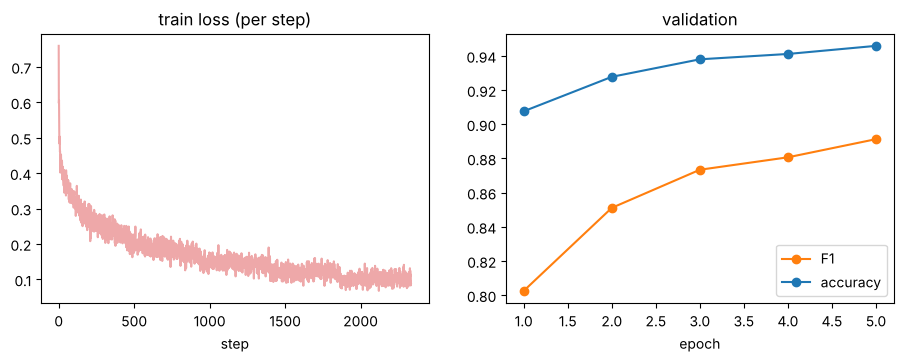
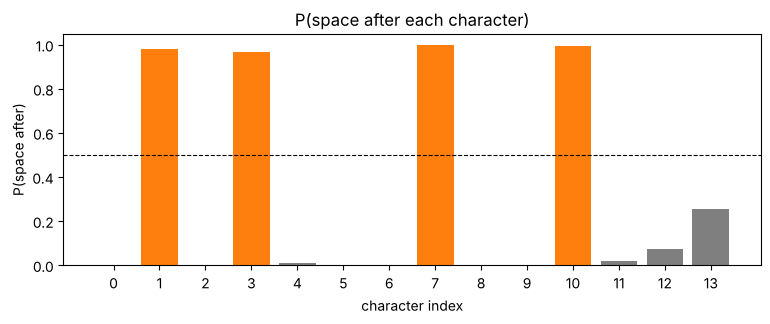

# 05-02 트랜스포머로 띄어쓰기 학습하기

[](https://colab.research.google.com/github/alsrjs0725/EntryToPytorchForStudent/blob/main/notebooks/05-띄어쓰기-모델/02-트랜스포머로-띄어쓰기-학습하기.ipynb)

[05-01](01-데이터-준비와-라벨-만들기.md)에서 만든 데이터로 띄어쓰기 모델을 학습시켜요. 모델은 [04-04의 인코더](../04-트랜스포머/04-트랜스포머-블록-만들기.md)에 분류 레이어 하나를 붙인 거예요. 이 문서를 마치면 붙여 쓴 문장의 띄어쓰기를 복원하는 모델을 학습시키고, 알맞은 지표로 평가할 수 있어요.

**사전 지식:** [05-01 데이터 준비와 라벨 만들기](01-데이터-준비와-라벨-만들기.md), [04-04 트랜스포머 블록 만들기](../04-트랜스포머/04-트랜스포머-블록-만들기.md)

완성한 모델은 이렇게 띄어 써요.

```
아버지가방에들어가신다         -> 아버지가 방에 들어가신다
나는오늘학교에서친구를만났다   -> 나는 오늘 학교에서 친구를 만났다
파이토치로띄어쓰기모델을만들었다 -> 파이토치로 띄어 쓰기 모델을 만들었다
```

!!! note "실행 시간"
    노트북 첫 부분의 준비 셀에 05-01의 데이터 코드를 모아 두었어요. 학습 셀은 CPU에서 약 4분 30초 걸렸어요. Colab T4 GPU에서는 이보다 빨라요. 문서의 출력은 CPU에서 실행한 결과라 GPU에서는 숫자가 조금 다를 수 있어요.

## 1. 모델: 인코더 + 분류 레이어

| 단계 | 레이어 | 모양 |
| --- | --- | --- |
| 입력 | 글자 번호 | `(B, T)` |
| 1 | 인코더 (임베딩 + 위치 + 블록 3개 + LayerNorm) | `(B, T, 128)` |
| 2 | 선형 레이어 `128 → 2` | `(B, T, 2)` |

마지막 축의 2는 "붙여 쓰기(0)"와 "뒤에 띄어 쓰기(1)"의 로짓이에요. 패딩 자리는 어텐션이 보지 않도록 [04-02의 패딩 마스크](../04-트랜스포머/02-멀티헤드-어텐션.md)를 만들어 인코더에 넘겨요.

```python
class SpacingModel(nn.Module):
    def __init__(self, vocab_size, pad_id, d_model=128, n_heads=4, n_layers=3, d_ff=512, max_len=128):
        super().__init__()
        self.pad_id = pad_id
        self.encoder = Encoder(vocab_size, d_model, n_heads, n_layers, d_ff, max_len)
        self.head = nn.Linear(d_model, 2)  # 0: 붙여 쓰기, 1: 뒤에 띄어 쓰기

    def forward(self, ids):
        # ids: (B, T)
        mask = (ids != self.pad_id)[:, None, None, :]  # (B, 1, 1, T), 패딩은 보지 않아요
        h = self.encoder(ids, mask)                    # (B, T, d_model)
        return self.head(h)                            # (B, T, 2)
```

```
파라미터 수: 798594
torch.Size([64, 66]) -> torch.Size([64, 66, 2])
```

파라미터 약 80만 개 중 약 19만 개는 글자 1,460개의 임베딩이에요.

## 2. 평가 지표: 정확도만으로는 부족해요

[05-01](01-데이터-준비와-라벨-만들기.md)에서 라벨 1의 비율이 25%라고 했어요. 모든 글자에 0이라고 답해도 정확도는 75%예요. 그래서 "띄어 써야 할 자리"를 얼마나 잘 찾는지 따로 봐요.

- **정밀도(precision):** 모델이 띄어 쓴 자리 중 실제로 띄어 써야 하는 비율. 낮으면 엉뚱한 곳을 띄워요.
- **재현율(recall):** 실제로 띄어 써야 하는 자리 중 모델이 찾은 비율. 낮으면 띄어야 할 곳을 놓쳐요.
- **F1:** 정밀도와 재현율의 조화 평균. 하나라도 낮으면 F1도 낮아요.

```python
pred = logits.argmax(-1)                                # (B, T)
valid = labels != -100                                  # 패딩 자리 빼기
tp += ((pred == 1) & (labels == 1)).sum().item()        # 맞게 띄운 자리
fp += ((pred == 1) & (labels == 0)).sum().item()        # 잘못 띄운 자리
fn += ((pred == 0) & (labels == 1)).sum().item()        # 놓친 자리
precision = tp / (tp + fp)
recall = tp / (tp + fn)
f1 = 2 * precision * recall / (precision + recall)
```

학습 전 모델은 무작위로 답해서 정확도 0.50, F1 0.35예요.

## 3. 학습

학습 루프는 [04-04](../04-트랜스포머/04-트랜스포머-블록-만들기.md)와 같아요. `ignore_index=-100`으로 패딩 자리를 손실에서 빼요. 옵티마이저는 Adam에 가중치 감쇠(weight decay)를 더한 AdamW를 써요. 트랜스포머 학습에 가장 많이 쓰는 옵티마이저예요.

```python
model = SpacingModel(len(tok), tok.pad_id).to(device)
optimizer = torch.optim.AdamW(model.parameters(), lr=1e-3)
for epoch in range(5):
    model.train()
    for ids, labels in train_dl:
        ids, labels = ids.to(device), labels.to(device)
        logits = model(ids)  # (B, T, 2)
        loss = F.cross_entropy(logits.reshape(-1, 2), labels.reshape(-1), ignore_index=-100)
        optimizer.zero_grad()
        loss.backward()
        optimizer.step()
    val = evaluate(model, val_dl)
```

에포크(epoch)는 학습 데이터 전체를 한 번 도는 단위예요. 5에포크를 학습했어요.

```
epoch 1: val loss=0.2220, acc=0.9076, f1=0.8025 (52s)
epoch 2: val loss=0.1799, acc=0.9277, f1=0.8511 (105s)
epoch 3: val loss=0.1566, acc=0.9380, f1=0.8734 (159s)
epoch 4: val loss=0.1511, acc=0.9411, f1=0.8807 (212s)
epoch 5: val loss=0.1413, acc=0.9458, f1=0.8913 (264s)
```



검증 F1이 에포크마다 올라가고 있어요. 아직 다 오르지 않았으니 에포크를 늘리면 더 좋아질 수 있어요.

## 4. 테스트 데이터로 평가하기

학습이 끝나고 테스트 데이터로 한 번 평가해요.

```
{'loss': 0.1377, 'acc': 0.9471, 'precision': 0.899, 'recall': 0.8901, 'f1': 0.8945}
항상 0으로 답하면 정확도 0.7478, F1 0
```

| 모델 | 정확도 | F1 |
| --- | --- | --- |
| 항상 0으로 답하기 | 0.748 | 0 |
| 트랜스포머 (5에포크) | 0.947 | 0.895 |

## 5. 띄어쓰기 복원하기

문장을 받아 공백을 지우고, 모델로 글자마다 "뒤에 띄어 쓸 확률"을 구해서 0.5보다 크면 띄어 써요.

```python
@torch.no_grad()
def restore_spacing(text):
    model.eval()
    text = text.replace(" ", "")
    ids = torch.tensor([tok.encode(text)], device=device)   # (1, T)
    probs = F.softmax(model(ids), dim=-1)[0, :, 1]           # (T,), 뒤에 띄어 쓸 확률
    return apply_spacing(text, (probs > 0.5).long().tolist()), probs.cpu()
```

"나는오늘학교에서친구를만났다"의 글자별 확률이에요. 1번(는), 3번(늘), 7번(서), 10번(를) 글자 뒤의 확률이 거의 1이에요.



테스트 문장 몇 개를 비교해 봐요.

```
정답: 범인은 징역 15년형과 벌금형을 받았다.
예측: 범인은 징역 15년형과 벌금형을 받았다.
정답: 누리호 후속사업을 2022년부터 착수할 예정이다.
예측: 누리호 후속사업을 2022년부터 착수할 예정이다.
정답: 김 차관은 고용상황을 낙관하기에는 반년은 이르다고 지적했다.
예측: 김 차관은 고용 상황을 낙관하기에는 반년은 이르다고 지적했다.
```

마지막 문장은 "다름"으로 채점됐지만, 맞춤법으로는 오히려 모델의 "고용 상황"이 맞아요. 학습 데이터의 띄어쓰기가 완벽하지 않다는 뜻이기도 해요. 문장 전체가 정답과 똑같은 비율은 42.9%예요. 한 문장에 띄어쓰기 자리가 여러 개라서, 하나만 틀려도 문장 전체가 틀린 것으로 세기 때문이에요.

"파이토치로 띄어 쓰기 모델을"처럼 학습 데이터에 드문 단어("띄어쓰기")는 아직 틀려요. 데이터를 늘리거나 더 오래 학습하면 나아져요.

## 자주 묻는 질문

??? question "`CUDA out of memory`가 나요"
    `batch_size`를 64에서 32로 줄여요. 다른 노트북이 GPU를 쓰고 있다면 **런타임 → 세션 관리**에서 끄고 다시 실행해요.

??? question "더 잘하게 하려면 무엇을 바꿔 볼까요"
    에포크 수(`epochs`), 레이어 수(`n_layers`), 벡터 길이(`d_model`)를 늘려 보세요. 검증 F1이 오르다 멈추거나 떨어지면 그만 늘려요.

## 정리

- 띄어쓰기 모델은 트랜스포머 인코더 뒤에 `d_model → 2` 선형 레이어를 붙인 거예요.
- 패딩은 어텐션 마스크로 가리고, 손실에서는 `ignore_index=-100`으로 빼요.
- 라벨이 한쪽으로 치우친 문제는 정확도보다 정밀도, 재현율, F1로 평가해요.

**다음 문서:** [06-01 다음 토큰 예측](../06-기초-LLM/01-다음-토큰-예측.md)
