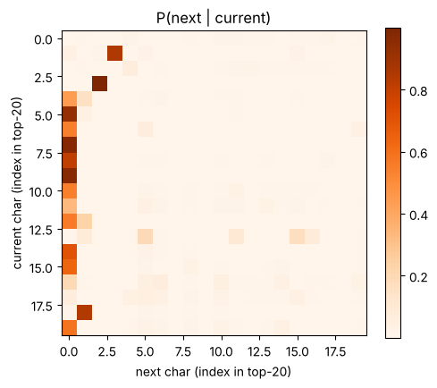
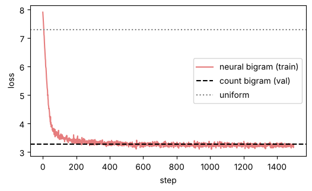

# 06-01 다음 토큰 예측

[](https://colab.research.google.com/github/alsrjs0725/EntryToPytorchForStudent/blob/main/notebooks/06-기초-LLM/01-다음-토큰-예측.ipynb)

ChatGPT 같은 LLM(Large Language Model, 대규모 언어 모델)이 하는 일은 놀랍도록 단순해요. 앞에 나온 토큰을 보고 **다음 토큰 하나**를 예측하는 거예요. 이걸 반복하면 글이 돼요. 이 문서를 마치면 다음 토큰 예측이 무엇인지 설명하고, 가장 단순한 언어 모델인 바이그램 모델을 만들어 글을 생성할 수 있어요.

**사전 지식:** [02-02 소프트맥스와 교차 엔트로피](../02-레이어-실제-구조와-종류/02-활성화-함수와-소프트맥스.md), [02-03 임베딩 레이어](../02-레이어-실제-구조와-종류/03-임베딩-레이어.md), [03-01 문자 단위 토크나이저](../03-토크나이저/01-문자-단위-토크나이저-만들기.md)

## 1. 말뭉치를 긴 문자열 하나로

[03-02](../03-토크나이저/02-단어와-서브워드-토큰화.md)의 KLUE 문장들을 줄바꿈 문자(`\n`)로 이어 붙여 긴 문자열 하나로 만들어요. 줄바꿈 문자는 "문장 끝"을 뜻하는 토큰이 돼요. 모델이 이 토큰을 내면 생성을 멈춰요.

```python
text = "\n".join(sentences) + "\n"
print(len(text))
```

```
1036833
```

문자 단위로 번호를 붙이면 어휘집은 1,473개예요. 전체를 정수 텐서 하나로 바꾸고, 앞 90%를 학습용, 뒤 10%를 검증용으로 나눠요.

```
어휘집 크기: 1473
torch.Size([933149]) torch.Size([103684])
```

## 2. 입력과 정답은 한 칸 차이

다음 토큰 예측은 따로 라벨을 만들 필요가 없어요. 글 자체가 정답이에요. 구간을 하나 잘라서, 정답은 한 칸 뒤로 민 구간으로 하면 돼요.

```python
chunk = train_ids[:11]
x, y = chunk[:-1], chunk[1:]  # 입력 10개, 정답 10개
```

```
'이'          -> '벤'
'이벤'         -> '트'
'이벤트'        -> ' '
'이벤트 '       -> '참'
'이벤트 참'      -> '여'
```

구간 하나에서 문맥 길이가 1, 2, 3, …인 예측 문제가 동시에 나와요. 각 위치의 문제는 "어휘집 1,473개 중 다음 글자 고르기"라는 분류예요. 그래서 손실은 [02-02의 교차 엔트로피](../02-레이어-실제-구조와-종류/02-활성화-함수와-소프트맥스.md)를 그대로 써요.

## 3. 가장 단순한 모델: 바로 앞 글자만 보기

먼저 바로 앞 글자 하나만 보고 다음 글자를 예측해요. 이런 모델을 바이그램(bigram) 모델이라고 해요. 학습 데이터에서 "글자 a 다음에 글자 b가 몇 번 나왔는지" 세면 끝이에요.

```python
counts = torch.zeros(V, V)  # (V, V), counts[a, b] = a 다음에 b가 나온 횟수
counts.index_put_((train_ids[:-1], train_ids[1:]), torch.ones(n - 1), accumulate=True)
probs = (counts + 0.01) / (counts + 0.01).sum(dim=1, keepdim=True)  # (V, V), 행마다 합이 1
```

행마다 합이 1이 되게 나누면 "a 다음에 올 글자의 확률"이 돼요. 0.01을 더하는 건 한 번도 안 나온 조합의 확률이 0이 되지 않게 하려는 거예요.

```
'학' -> [('교', 0.214), ('생', 0.171), (' ', 0.075), ('자', 0.036), ('기', 0.031)]
'니' -> [('다', 0.844), ('는', 0.017), ('라', 0.015), (' ', 0.015), ('었', 0.008)]
'\n' -> [('이', 0.063), ('그', 0.021), ('아', 0.017), ('영', 0.017), ('한', 0.017)]
```

"학" 다음에는 "교", "생"이 자주 오고, "니" 다음에는 84% 확률로 "다"가 와요. 문장 첫 글자(`\n` 다음)로는 "이"가 가장 많아요.

가장 자주 나온 글자 20개끼리의 확률표예요. 0번은 공백, 1번은 "다", 2번은 줄바꿈, 3번은 마침표예요.

{ width="450" }

1번 행("다" 다음)은 3번 열(마침표)이 진해요. "~다." 패턴이에요. 3번 행(마침표 다음)은 2번 열(줄바꿈)이 진해요. 마침표 뒤에 문장이 끝나요.

## 4. 손실로 모델 평가하기

언어 모델은 검증 데이터의 다음 글자에 준 확률의 `-log`, 즉 교차 엔트로피로 평가해요. 낮을수록 다음 글자를 잘 맞혀요. 아무것도 모르고 1,473개에 같은 확률을 주면 손실은 `log(1473) = 7.295`예요.

```
아무것도 모를 때(균등 분포) 손실: 7.295
바이그램 손실 (검증): 3.282
```

앞 글자 하나만 봐도 손실이 절반 아래로 떨어졌어요.

## 5. 바이그램으로 글 만들기

생성은 "확률대로 다음 글자 하나 뽑기 → 그 글자를 다음 입력으로"를 반복해요. `torch.multinomial`은 확률표대로 번호를 하나 뽑아요.

```python
def generate_bigram(start, length=60, seed=0):
    g = torch.Generator().manual_seed(seed)
    out = [stoi[start]]
    for _ in range(length):
        nxt = torch.multinomial(probs[out[-1]], 1, generator=g).item()  # 확률대로 하나 뽑기
        out.append(nxt)
    return "".join(itos[i] for i in out)

print(generate_bigram("오"))
```

```
오에 아키 영화가도 아가능하지 오고 마을 채누리를 수였습니다시아들은 수 생으로자격을 발열었다봤더 사업주머물체포
```

"영화가", "마을", "수였습니다" 같은 조각은 그럴듯하지만, 전체는 뜻이 없어요. 바로 앞 글자 하나만 보니 문장 전체의 흐름을 모르기 때문이에요.

## 6. 같은 모델을 신경망으로: 임베딩 하나

바이그램 확률표는 `(V, V)` 행렬이에요. [02-03의 임베딩](../02-레이어-실제-구조와-종류/03-임베딩-레이어.md)도 번호마다 행 하나를 꺼내는 표였죠. 그래서 `nn.Embedding(V, V)` 하나가 바이그램 모델이 돼요. 꺼낸 행을 다음 글자의 로짓으로 쓰고, 세는 대신 경사 하강법으로 학습해요.

```python
class BigramLM(nn.Module):
    def __init__(self, V):
        super().__init__()
        self.table = nn.Embedding(V, V)  # 행 = 현재 문자, 열 = 다음 문자 점수

    def forward(self, ids):
        return self.table(ids)  # (B, T) -> (B, T, V)
```

학습 데이터에서 길이 32짜리 구간 64개를 무작위로 뽑아 배치를 만들어요.

```python
def get_batch(ids, batch_size, block_size):
    starts = torch.randint(0, len(ids) - block_size - 1, (batch_size,))
    x = torch.stack([ids[s : s + block_size] for s in starts])          # (B, block_size)
    y = torch.stack([ids[s + 1 : s + block_size + 1] for s in starts])  # (B, block_size), 한 칸 뒤
    return x.to(device), y.to(device)
```

```
신경망 바이그램 손실 (검증): 3.356
```

{ width="500" }

1,500단계 학습한 신경망이 세어서 만든 바이그램(3.282)에 거의 다가갔어요. 같은 모델을 다른 방법으로 만든 거예요. 신경망으로 만들면 좋은 점은, 이 임베딩 자리에 **앞 글자 전체를 보는 트랜스포머**를 넣을 수 있다는 거예요. 그게 다음 문서의 GPT예요.

## 정리

- 언어 모델은 앞 토큰을 보고 다음 토큰을 고르는 분류를 반복해요. 입력과 정답은 한 칸 차이예요.
- 바이그램 모델은 바로 앞 토큰만 보는 확률표예요. 세어서 만들 수도, `nn.Embedding(V, V)`로 학습할 수도 있어요.
- 손실은 교차 엔트로피이고, 앞 문맥을 더 많이 볼수록 낮아질 수 있어요.

**다음 문서:** [06-02 디코더 전용 모델 만들기](02-디코더-전용-모델-만들기.md)
