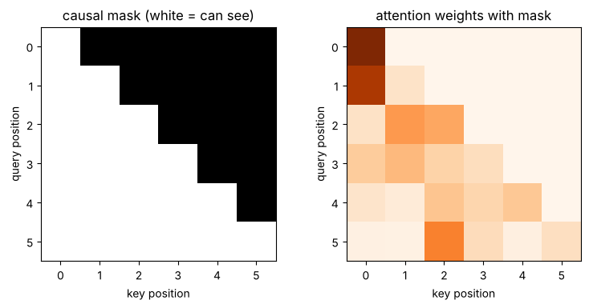
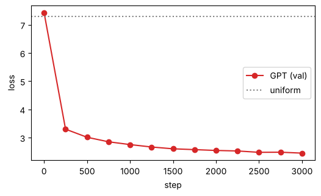
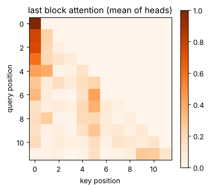

# 06-02 디코더 전용 모델 만들기

[](https://colab.research.google.com/github/alsrjs0725/EntryToPytorchForStudent/blob/main/notebooks/06-기초-LLM/02-디코더-전용-모델-만들기.ipynb)

[06-01](01-다음-토큰-예측.md)의 바이그램은 바로 앞 글자 하나만 봤어요. 앞 문맥 전체를 보려면 트랜스포머를 써야 해요. 다만 다음 토큰을 예측할 때 미래 토큰을 보면 안 되니, 어텐션에 마스크를 씌워요. 이렇게 만든 모델을 디코더 전용(decoder-only) 모델이라고 하고, GPT가 바로 이 구조예요. 이 문서를 마치면 작은 GPT를 직접 구현하고 한국어 말뭉치로 학습시켜 문장을 생성할 수 있어요.

**사전 지식:** [06-01 다음 토큰 예측](01-다음-토큰-예측.md), [04-04 트랜스포머 블록 만들기](../04-트랜스포머/04-트랜스포머-블록-만들기.md)

학습한 모델에 문장 앞부분을 주면 이어서 써요.

```
오늘에 아키 영화가 오아가 멀져 있습니다.
정부는 2252000명 이상 추가 후보가 처음에 당첨자 당사자였다.
이 영화는 22명이었습니다.
```

뜻은 엉성하지만 띄어쓰기, 조사, "~습니다."로 끝나는 문장 모양을 스스로 배웠어요. 글자 단위로 3000단계만 학습한 작은 모델이라는 점을 생각하면 꽤 그럴듯해요.

!!! note "실행 시간"
    학습 셀은 CPU에서 약 16분 걸렸어요. Colab T4 GPU에서는 몇 분이면 끝나요. 문서의 출력은 CPU에서 실행한 결과예요.

## 1. 문제: 미래를 보면 안 돼요

[06-01](01-다음-토큰-예측.md)에서 본 대로 입력과 정답은 한 칸 차이예요. 토큰 64개를 한 번에 넣으면 64개 위치에서 동시에 다음 토큰을 예측해 학습 효율이 좋아요. 그런데 [04-04의 인코더](../04-트랜스포머/04-트랜스포머-블록-만들기.md)는 모든 토큰이 모든 토큰을 봐요. 위치 3의 다음 토큰을 맞히는데 위치 4(정답)를 보면 답을 베끼는 셈이에요.

## 2. 인과 마스크: 앞쪽만 보기

토큰 i가 자기와 앞쪽 토큰(0~i)만 보도록 마스크를 만들어요. 아래 삼각형만 `True`인 행렬이에요. 이걸 인과 마스크(causal mask)라고 해요.

```python
T = 6
causal = torch.tril(torch.ones(T, T, dtype=torch.bool))  # (T, T), 아래 삼각형만 True
scores = torch.randn(T, T).masked_fill(~causal, float("-inf"))
weights = F.softmax(scores, dim=-1)                      # (T, T)
print(weights.round(decimals=2))
```

```
tensor([[1.0000, 0.0000, 0.0000, 0.0000, 0.0000, 0.0000],
        [0.8600, 0.1400, 0.0000, 0.0000, 0.0000, 0.0000],
        [0.1500, 0.4500, 0.4000, 0.0000, 0.0000, 0.0000],
        [0.2700, 0.3300, 0.2300, 0.1700, 0.0000, 0.0000],
        [0.1300, 0.0800, 0.2900, 0.2200, 0.2800, 0.0000],
        [0.0400, 0.0300, 0.5400, 0.1800, 0.0500, 0.1600]])
```

{ width="600" }

[04-02의 패딩 마스크](../04-트랜스포머/02-멀티헤드-어텐션.md)와 같은 방법이에요. 가릴 자리 점수를 `-inf`로 바꾸면 가중치가 0이 돼요. 첫 토큰은 자기만 보니 가중치가 1이에요.

## 3. GPT 모델

구조는 [04-04](../04-트랜스포머/04-트랜스포머-블록-만들기.md)와 거의 같아요. 달라진 곳은 세 군데예요.

- 어텐션에 인과 마스크를 항상 씌워요.
- Q, K, V를 선형 레이어 하나(`qkv`)로 한 번에 만들고 셋으로 나눠요. 계산은 같고 조금 빨라요.
- 마지막에 `d_model → 어휘집 크기` 선형 레이어(`lm_head`)를 붙여 위치마다 다음 토큰 점수를 내요.

| 단계 | 레이어 | 모양 |
| --- | --- | --- |
| 입력 | 글자 번호 | `(B, T)` |
| 1 | 토큰 임베딩 + 위치 임베딩 | `(B, T, 192)` |
| 2 | 블록 × 4 (인과 마스크 어텐션 + 피드포워드) | `(B, T, 192)` |
| 3 | LayerNorm | `(B, T, 192)` |
| 4 | `lm_head` 선형 레이어 | `(B, T, 1473)` |

```python
class CausalSelfAttention(nn.Module):
    def __init__(self, d_model, n_heads, max_len):
        super().__init__()
        self.n_heads, self.d_head = n_heads, d_model // n_heads
        self.qkv = nn.Linear(d_model, 3 * d_model)  # q, k, v를 한 번에 계산해요
        self.out_proj = nn.Linear(d_model, d_model)
        causal = torch.tril(torch.ones(max_len, max_len, dtype=torch.bool))
        self.register_buffer("causal", causal)  # 학습하지 않는 텐서. model.to(device)로 함께 옮겨져요

    def forward(self, x):
        B, T, C = x.shape
        q, k, v = self.qkv(x).split(C, dim=-1)  # 각각 (B, T, C)
        q, k, v = (t.view(B, T, self.n_heads, self.d_head).transpose(1, 2) for t in (q, k, v))  # (B, H, T, d_head)
        scores = q @ k.transpose(-2, -1) / math.sqrt(self.d_head)        # (B, H, T, T)
        scores = scores.masked_fill(~self.causal[:T, :T], float("-inf"))  # 미래는 가려요
        self.weights = F.softmax(scores, dim=-1)
        out = (self.weights @ v).transpose(1, 2).reshape(B, T, C)        # (B, T, C)
        return self.out_proj(out)
```

`Block`은 04-04의 `TransformerBlock`에서 마스크 인자만 뺀 거예요. `GPT`는 04-04의 `Encoder` 뒤에 `lm_head`를 붙인 거예요. 전체 코드는 노트북에 있어요.

```
파라미터 수: 2359233
torch.Size([4, 64]) -> torch.Size([4, 64, 1473])
```

## 4. 미래를 정말 못 보는지 확인하기

뒤 두 글자만 다른 두 문장을 넣어 봐요. 마스크가 제대로 동작하면 앞 8자리의 출력은 완전히 같아야 해요. 앞 8자리는 달라진 글자를 볼 수 없으니까요.

```python
a = torch.tensor([encode("오늘은 날씨가 좋다")], device=device)  # (1, 10)
b = torch.tensor([encode("오늘은 날씨가 나쁘")], device=device)  # (1, 10)
la, lb = model(a), model(b)
```

```
앞 8자리 출력이 같은가: True
마지막 자리 출력이 같은가: False
```

## 5. 학습

학습 데이터에서 64글자짜리 구간을 무작위로 64개 뽑아 배치를 만들어요. 정답은 한 칸 뒤로 민 구간이에요. 손실은 위치마다 1,473개 클래스 중 정답을 고르는 교차 엔트로피예요.

```python
model = GPT(V).to(device)
optimizer = torch.optim.AdamW(model.parameters(), lr=1e-3)
for step in range(3001):
    x, y = get_batch(train_ids, 64, model.max_len)   # (64, 64), (64, 64)
    logits = model(x)                                # (64, 64, V)
    loss = F.cross_entropy(logits.reshape(-1, V), y.reshape(-1))
    optimizer.zero_grad()
    loss.backward()
    optimizer.step()
torch.save(model.state_dict(), "gpt.pt")
```

250단계마다 검증 데이터로 손실을 재요.

```
step    0: val loss=7.435 (4s)
step  500: val loss=3.012 (165s)
step 1000: val loss=2.752 (319s)
step 2000: val loss=2.544 (632s)
step 3000: val loss=2.449 (942s)
```

{ width="500" }

06-01의 바이그램(3.282)보다 손실이 0.8 넘게 낮아요. 앞 문맥을 볼 수 있으니 다음 글자를 훨씬 잘 맞혀요. 학습이 끝나면 `gpt.pt`로 저장해서 [06-03](03-샘플링으로-문장-생성하기.md)에서 불러 써요.

## 6. 문장 생성하기

생성은 "다음 토큰 예측 → 뽑기 → 뒤에 붙이기"를 반복해요. 줄바꿈 문자(문장 끝)가 나오거나 정한 길이가 되면 멈춰요. 모델이 볼 수 있는 길이는 64글자라서, 그보다 길어지면 마지막 64글자만 넣어요.

```python
@torch.no_grad()
def generate(model, prompt, max_new_tokens=80, seed=0):
    model.eval()
    g = torch.Generator(device=device).manual_seed(seed)
    ids = torch.tensor([encode(prompt)], device=device)  # (1, T)
    for _ in range(max_new_tokens):
        context = ids[:, -model.max_len :]                # 최대 길이까지만 봐요
        logits = model(context)[:, -1, :]                 # (1, V), 마지막 자리의 다음 토큰 점수
        probs = F.softmax(logits, dim=-1)
        nxt = torch.multinomial(probs, 1, generator=g)    # (1, 1), 확률대로 하나 뽑기
        ids = torch.cat([ids, nxt], dim=1)                # (1, T + 1)
        if itos[nxt.item()] == "\n":
            break
    return decode(ids[0].tolist())
```

`logits`는 위치마다 나오지만, 생성에는 마지막 위치의 점수만 써요. 문서 맨 위의 문장이 이 함수로 만든 결과예요.

학습한 모델의 마지막 블록 어텐션을 "학교에서 친구를 만났다"로 그려 보면, 위쪽 삼각형이 모두 0이에요. 어떤 글자도 뒤쪽 글자를 보지 않아요.

{ width="380" }

## 자주 묻는 질문

??? question "인코더와 디코더 전용 모델은 무엇이 다른가요"
    블록 구조는 같고, 어텐션 마스크만 달라요. 인코더(05 띄어쓰기 모델)는 문장 전체를 보고 토큰마다 라벨을 맞혀요. 디코더 전용 모델은 앞쪽만 보고 다음 토큰을 맞혀서, 한 글자씩 이어 쓰는 생성에 알맞아요.

??? question "더 그럴듯한 문장을 만들려면"
    학습 단계(`max_steps`), 모델 크기(`d_model`, `n_layers`), 볼 수 있는 길이(`max_len`)를 늘려요. 토크나이저를 [03-02의 BPE](../03-토크나이저/02-단어와-서브워드-토큰화.md)로 바꾸면 같은 길이에 더 많은 내용을 담을 수 있어요.

## 정리

- 디코더 전용 모델은 인과 마스크로 앞쪽 토큰만 보고 다음 토큰을 예측해요.
- GPT는 임베딩 + 위치 + 블록 N개 + LayerNorm + `lm_head`이고, 출력은 `(B, T, 어휘집 크기)`예요.
- 생성은 마지막 위치의 확률에서 토큰을 뽑아 붙이기를 반복해요.

**다음 문서:** [06-03 샘플링으로 문장 생성하기](03-샘플링으로-문장-생성하기.md)
