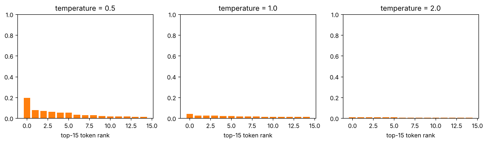

# 06-03 샘플링으로 문장 생성하기

[](https://colab.research.google.com/github/alsrjs0725/EntryToPytorchForStudent/blob/main/notebooks/06-기초-LLM/03-샘플링으로-문장-생성하기.ipynb)

모델은 다음 토큰의 확률만 알려 줘요. 그 확률에서 실제로 어떤 토큰을 고를지는 따로 정해야 해요. 고르는 방법(샘플링, sampling)에 따라 같은 모델도 전혀 다른 글을 써요. 이 문서를 마치면 그리디, 온도, top-k 샘플링의 차이를 설명하고 원하는 방식으로 문장을 생성할 수 있어요.

**사전 지식:** [06-02 디코더 전용 모델 만들기](02-디코더-전용-모델-만들기.md)

!!! note "모델 준비"
    노트북 첫 부분의 준비 셀은 06-02에서 저장한 `gpt.pt`가 있으면 불러오고, 없으면 같은 설정으로 다시 학습해요. Colab은 노트북마다 런타임이 따로라서, 보통은 다시 학습하게 돼요. 학습 후 `model.eval()`로 드롭아웃을 꺼요. 켜 두면 같은 설정으로도 결과가 매번 달라져요.

## 1. 다음 토큰 확률 살펴보기

"오늘 날씨가 "까지 넣었을 때 다음 글자의 확률 상위 10개예요.

```python
logits = next_token_logits("오늘 날씨가 ")   # (V,)
probs = F.softmax(logits, dim=-1)
```

```
'있': 0.042
'아': 0.026
'이': 0.025
'나': 0.024
'부': 0.022
'지': 0.022
'발': 0.018
'출': 0.016
'열': 0.016
'오': 0.013
```

1등도 4.2%예요. 확률이 넓게 퍼져 있어서, 어떤 글자를 고르느냐에 따라 문장이 크게 달라져요.

## 2. 그리디: 항상 가장 높은 것

가장 단순한 방법은 매번 확률이 가장 높은 토큰을 고르는 그리디(greedy) 디코딩이에요. 같은 입력이면 항상 같은 문장이 나와요.

```python
nxt = logits.argmax().item()
```

```
오늘 인천 부산 해경 해수욕장 이용객은 1000만원 이상 이상 이상 1000만원 이상 1000만원 이상 투자자들의 대상이 아닌 것으로 보인다.
정부는 이번 지난 12일 오전 11시 30분 경에 발행되었다.
```

"이상 이상 이상"처럼 같은 말을 되풀이하기 쉬워요. 한 번 높은 확률을 받은 패턴을 계속 고르기 때문이에요. 매번 같은 글만 나오는 것도 단점이에요.

## 3. 온도(temperature)

확률대로 뽑되, 뽑기 전에 로짓을 온도 `t`로 나눠서 확률이 퍼진 정도를 조절해요.

$$
p_i = \text{softmax}\left(\frac{z_i}{t}\right)
$$

```python
logits = logits / temperature
nxt = torch.multinomial(F.softmax(logits, dim=-1), 1, generator=g).item()
```



- `t < 1`: 큰 로짓이 더 커져서 확률이 위쪽에 몰려요. 그리디에 가까워져요.
- `t = 1`: 모델의 확률 그대로예요.
- `t > 1`: 확률이 평평해져서 낮은 순위 토큰도 자주 뽑혀요.

"오늘"로 시작해 온도마다 세 번씩 생성했어요.

```
[온도 0.5]
  오늘 2012년 11월 13일 오후 3시 경과 경기도 북한이 지난 2017년 11월 12일 회의를 받고 있다.
  오늘 지난 2011년 1월 1일 이전 11일 오전 11시 3시 인천 인권 이상 30분 이상 이상이 낮다.
  오늘 기자회견을 열었다.
[온도 1.0]
  오늘에 아키 영화가 오아가 멀져 있습니다.
  오늘 지난 추경보호종 신청 브릭스가 조선민주주의인민공화국이 전원에서 금돼, 박찬욱 네으킨 것이 이해하여 한 명이 낭인되었다.
  오늘 특산발보다 다른 요구조는 시간 지역 가까이 있습니다.
[온도 1.5]
  오늘에, 발행, 게도교아 3만 간격서 마처 채누카셔뿐이였었습니다.
  오늘 세 한 사람이었습니다.
  오늘 특파발사업 문명소요원이 한시생활장관 느껴졌길관직법의 대폭활과 연구축의 문제악사를 살펴넣고 쭈존색이라고 합니다.
```

온도가 낮으면 날짜, 시간처럼 말뭉치에 흔한 표현을 되풀이하고, 온도가 높으면 없는 단어("채누카셔뿐이였었습니다")가 늘어요.

## 4. top-k 샘플링

온도가 높을 때 문제는 확률이 아주 낮은 엉뚱한 글자가 뽑히는 거예요. top-k 샘플링은 확률 상위 k개만 남기고 나머지를 `-inf`로 지운 뒤 뽑아요.

```python
kth = logits.topk(top_k).values[-1]
logits = logits.masked_fill(logits < kth, float("-inf"))  # 상위 k개만 남기기
```

```
[top-k 1]
  정부는 이번 지난 12일 오전 11시 30분 경에 발행되었다.
  정부는 이번 지난 12일 오전 11시 30분 경에 발행되었다.
  정부는 이번 지난 12일 오전 11시 30분 경에 발행되었다.
[top-k 5]
  정부는 지난 2007년 1031년 이후 임기 예산을 실시한다.
  정부는 지난 27일, 이 대한민국 대학 이상으로 발견되는 사건을 추진하기 위해서는 100여명이 참여하고 이러한 가지고 있다는 일이 밝을 것입니다.
  정부는 지난 63년 인공 소득을 거쳐 대상 12월 11일까지 12만 46000만원을 기록해준다.
[top-k 50]
  정부는 2252000명 이상 추가 20명이라는 대피문자로 이어졌다.
  정부는 지난 추경보호종 신청 브리핑에서 이루어졌다.
  정부는 기밀 보고서야해준다.
```

- `k=1`은 그리디와 같아요. 세 번 모두 같은 문장이에요.
- `k=5`는 다양하면서도 흔한 표현 안에서 골라요.
- `k=50`은 더 다양하지만 어색한 조합도 늘어요.

| 방법 | 다양성 | 엉뚱한 토큰 | 같은 말 반복 |
| --- | --- | --- | --- |
| 그리디 | 없음 | 적음 | 많음 |
| 낮은 온도 | 적음 | 적음 | 있음 |
| 높은 온도 | 많음 | 많음 | 적음 |
| top-k | k로 조절 | k가 작으면 적음 | k가 작으면 있음 |

실제 서비스는 온도와 top-k(또는 비슷한 top-p)를 함께 써요.

## 5. 직접 해 보기

온도와 top-k를 함께 바꿔 가며 원하는 문장을 만들어 보세요.

```python
print(generate("이 영화는", temperature=0.8, top_k=20, seed=0))
```

```
이 영화는 다른 분위기가 있다.
```

## 정리

- 모델은 확률만 주고, 어떤 토큰을 고를지는 샘플링 방법이 정해요.
- 그리디는 항상 1등을 골라 같은 말을 반복하기 쉬워요. 온도는 확률이 퍼진 정도를, top-k는 후보 수를 조절해요.
- 낮은 온도와 작은 k는 안전하지만 단조롭고, 높은 온도와 큰 k는 다양하지만 엉뚱해요.

**다음 단계:** 튜토리얼을 모두 마쳤어요. 06-02의 모델을 키우거나, 토크나이저를 [03-02의 BPE](../03-토크나이저/02-단어와-서브워드-토큰화.md)로 바꾸거나, 다른 말뭉치로 학습시켜 보세요.
